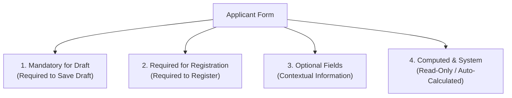

# Applicant Registration - Frontend Developer Specification

This document provides the complete classification, data types, constraints, and API interaction details for the **Applicant Registration** module.

---

## 1. Field Classification Overview



---

## 2. Detailed Field Definitions

### Stage 1: Mandatory for Draft (To Save Any Record)
The frontend form must enforce these fields before allowing the initial **"Save as Draft"** action.

| Field Name (`fieldname`) | UI Label | Data Type | Options / Choices | Validation / Behavior |
| :--- | :--- | :--- | :--- | :--- |
| `first_name` | First Name | `string` | — | Required, trimmed string |
| `last_name` | Last Name | `string` | — | Required, trimmed string |
| `gender` | Gender | `select` | `["Male", "Female"]` | Required, no default selection |
| `religion` | Religion | `select` | `["Muslim", "Orthodox", "Protestant", "Catholic", "Other"]` | Required, no default selection |
| `marital_status` | Marital Status | `select` | `["Single", "Married", "Divorced", "Widowed"]` | Required, no default selection |
| `children` | Children (Count) | `integer` | — | Required (explicit input, enter `0` if none) |
| `nationality` | Nationality | `string` (Link) | Link to `Country` (e.g. `"Ethiopia"`) | Required |
| `phone_number` | Phone Number | `string` | — | Required primary contact |
| `city` | City | `string` | — | Required residential city |
| `country` | Country | `string` | — | Required residential country |

---

### Stage 2: Required for Registration (Draft $\rightarrow$ Registered)
These fields are not required to save an initial draft, but are **strictly required** when the user clicks **"Register Applicant"**.

| Field Name (`fieldname`) | UI Label | Data Type | Options / Choices | Validation / Behavior |
| :--- | :--- | :--- | :--- | :--- |
| `date_of_birth` | Date of Birth | `date` (`YYYY-MM-DD`) | — | Cannot be in the future |
| `passport_number` | Passport Number | `string` | — | Converted to uppercase |
| `highest_education` | Highest Education Level | `select` | `["High School", "Associate Degree", "Bachelor's Degree", "Master's Degree", "Doctorate", "Other"]` | Required selection |
| `labour_id` | Labour ID Number | `string` | — | Ministry Labor ID |
| `contact_person_name` | Contact Person Name | `string` | — | Emergency / reference contact name |
| `contact_person_phone` | Contact Person Phone | `string` | — | Emergency / reference contact phone |
| `coc_status` | COC Status | `select` | `["Pending", "Issued", "Not Started"]` | Certificate of Competence status |
| `exam_date` | COC Exam Date | `date` (`YYYY-MM-DD`) | — | Exam date |
| `medical_status` | Medical Status | `select` | `["FIT", "UNFIT", "Pending"]` | **Note:** Registration is blocked if `UNFIT` |
| `medical_expiry_date` | Medical Expiration Date | `date` (`YYYY-MM-DD`) | — | Medical validity expiration date |

---

### Stage 3: Optional Fields
These fields provide extra details and can be saved or left empty at any stage.

| Field Name (`fieldname`) | UI Label | Data Type | Description |
| :--- | :--- | :--- | :--- |
| `middle_name` | Middle Name | `string` | Grandfather name |
| `alternate_phone` | Alternate Phone | `string` | Secondary phone number |
| `email` | Email Address | `string` (`email`) | Format validated if entered |
| `region` | Region | `string` | Administrative region / State |
| `sub_region` | Sub Region / Zone | `string` | Zone / Woreda / Sub-city |
| `address_line_1` | Address Line 1 | `string` | Street address / house number |
| `national_id` | National ID Number | `string` | National ID / Kebele card number |
| `passport_expiry` | Passport Expiry Date | `date` (`YYYY-MM-DD`) | Expiration date of passport |
| `institution` | Institution Name | `string` | School or university name |
| `graduation_year` | Graduation Year | `integer` | Year graduated |
| `current_employer` | Current/Last Employer | `string` | Previous employer |
| `years_of_experience` | Years of Experience | `float` | Years of relevant work experience |
| `remarks` | General Remarks | `text` | General candidate notes |
| `medical_remarks` | Medical Remarks | `text` | Medical check details & notes |
| `education_remarks` | Education Remarks | `text` | Training, skills & education notes |

---

### Stage 4: Auto-Computed & System Fields (Read-Only on UI)
The frontend should display these as **read-only badges or computed summary cards**.

| Field Name (`fieldname`) | UI Label | Data Type | Formula / Origin |
| :--- | :--- | :--- | :--- |
| `full_name` | Full Name | `string` | `first_name + " " + middle_name + " " + last_name` |
| `exam_remaining_days` | Exam Remaining Days | `integer` | `exam_date - today()` (in days) |
| `medical_remaining_days` | Medical Remaining Days | `integer` | `medical_expiry_date - today()` (in days) |
| `applicant_state` | Applicant State | `select` | `["Draft", "Registered", "CV Generated", "Contract Requested", "Dossier Submitted", "Processing", "Stamped", "Ticketed", "Departed", "Cancelled"]` (Default: `Draft`) |
| `registration_date` | Registration Date | `date` | Auto-set on creation |
| `total_income` | Total Income | `currency` | Calculated sum of all `Income` rows |
| `total_expense` | Total Expense | `currency` | Calculated sum of all `Expense` rows |
| `net_balance` | Net Balance | `currency` | `total_income - total_expense` |

---

## 3. Financial Sub-Table: `income_expense_logs`
A single table under the Financials section where staff log financial transactions.

```json
{
  "transaction_type": "Income", // "Income" or "Expense"
  "amount": 5000.00,
  "date": "2026-08-14",
  "description": "Initial registration deposit"
}
```

---

## 4. REST API Integration Guide

### 1. Create Draft Applicant
* **Endpoint:** `POST /api/resource/Applicant`
* **Headers:** `Content-Type: application/json`
* **Request Payload Example:**
```json
{
  "first_name": "Abebe",
  "middle_name": "Bekele",
  "last_name": "Kebede",
  "gender": "Male",
  "religion": "Muslim",
  "marital_status": "Married",
  "children": 2,
  "nationality": "Ethiopia",
  "phone_number": "+251911223344",
  "city": "Addis Ababa",
  "country": "Ethiopia",
  "region": "Oromia",
  "remarks": "Available immediately"
}
```

---

### 2. Transition State: Register Applicant
* **Endpoint:** `POST /api/method/applicant_processing.applicant_processing.doctype.applicant.applicant.register_applicant`
* **Request Payload:**
```json
{
  "applicant_name": "APP-00001"
}
```
* **Success Response:**
```json
{
  "message": "Applicant APP-00001 is now Registered."
}
```
* **Validation Error Response (e.g. Missing Fields or UNFIT):**
```json
{
  "exc": "...",
  "_server_messages": "[\"Missing required field(s): Date of Birth, Passport Number, Highest Education Level, Labour ID\"]"
}
```

---

### 3. Generate CV PDF
* **Endpoint:** `POST /api/method/applicant_processing.applicant_processing.doctype.applicant.applicant.generate_cv`
* **Request Payload:**
```json
{
  "applicant_name": "APP-00001"
}
```
* **Success Response:**
```json
{
  "message": {
    "cv_record": "CV-00001",
    "file_url": "/private/files/CV-APP-00001-CV-00001.pdf",
    "message": "CV generated successfully: CV-00001"
  }
}
```

---

## 5. UI / UX Best Practice Recommendations for Frontend Team

1. **Reactive Computed Badges:**
   - When picking `exam_date` or `medical_expiry_date`, immediately compute and display the remaining days badge:
     - 🟢 **> 30 Days Remaining**: Green badge
     - 🟡 **10–30 Days Remaining**: Yellow warning badge
     - 🔴 **< 10 Days / Expired**: Red alert badge
2. **Draft vs Registration Flow:**
   - Show a **"Save Draft"** button (validates Stage 1 fields).
   - Show a primary **"Register Applicant"** button (checks both Stage 1 & Stage 2 fields with pre-validation modal).
3. **Medical FIT Check:**
   - If `medical_status === "UNFIT"`, disable the "Register" button and show a notice badge: *"Applicant cannot be registered while medical status is UNFIT."*
