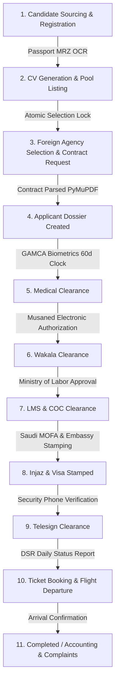

# Applicant Processing System — Complete System & API Documentation (0 to Hero)

This document is the **single source of truth** for frontend developers, mobile engineers, backend developers, QA testers, and DevOps engineers building upon or integrating with the **Applicant Processing System**.

---

# Table of Contents
1. [Executive Summary & Domain Overview](#1-executive-summary--domain-overview)
2. [End-to-End Business Lifecycle](#2-end-to-end-business-lifecycle)
3. [System Architecture & Tech Stack](#3-system-architecture--tech-stack)
4. [Complete DocType Reference (All 24 DocTypes)](#4-complete-doctype-reference-all-24-doctypes)
5. [Complete REST API Reference](#5-complete-rest-api-reference)
   - [5.1 Authentication & Security](#51-authentication--security)
   - [5.2 Candidate Registration & MRZ OCR APIs](#52-candidate-registration--mrz-ocr-apis)
   - [5.3 Candidate Selection & Agency Portal APIs](#53-candidate-selection--agency-portal-apis)
   - [5.4 Contract Requests & CV Generation APIs](#54-contract-requests--cv-generation-apis)
   - [5.5 Clearances & Pipeline State APIs](#55-clearances--pipeline-state-apis)
   - [5.6 DSR & Deployment Operations APIs](#56-dsr--deployment-operations-apis)
   - [5.7 Foreign Agency Complaints Desk APIs](#57-foreign-agency-complaints-desk-apis)
   - [5.8 Accounting, Fees & Commission APIs](#58-accounting-fees--commission-apis)
   - [5.9 Operations & Executive Reporting APIs](#59-operations--executive-reporting-apis)
   - [5.10 Web Push & System Notification APIs](#510-web-push--system-notification-apis)
   - [5.11 Generic CRUD Resource APIs (`/api/resource`)](#511-generic-crud-resource-apis-apiresource)
6. [Frontend Client Implementation Blueprints](#6-frontend-client-implementation-blueprints)
   - [6.1 Web Push Manager (`web_push_client.js`)](#61-web-push-manager-web_push_clientjs)
   - [6.2 Service Worker (`sw.js`)](#62-service-worker-swjs)
   - [6.3 File Upload Pattern](#63-file-upload-pattern)
7. [Automated Scheduler Watchdogs & Crons](#7-automated-scheduler-watchdogs--crons)
8. [Docker & Production Deployment Guide](#8-docker--production-deployment-guide)

---

# 1. Executive Summary & Domain Overview

The **Applicant Processing System** is an enterprise labor deployment and recruitment orchestration platform. It manages the full lifecycle of overseas candidates (primarily from East Africa/Ethiopia to GCC corridors including Saudi Arabia, Kuwait, UAE, Qatar, Oman, and Jordan).

### Core Problem Solved:
Recruiting overseas workers involves strict government compliance gates, biometrics, multi-embassy clearances, electronic authorizations (Musaned/Wakala), document extraction (MRZ/PDF), multi-currency accounting, and rapid dispute handling. This platform unifies all operations into a single deterministic pipeline with real-time notifications.

---

# 2. End-to-End Business Lifecycle

The candidate processing lifecycle consists of **11 consecutive stages**:



### Stage Summary:
1. **Intake & OCR**: Candidate identity scanned via MRZ OCR (`P<ETH...`). Photos and education validated.
2. **CV & Pool**: Candidate profile rendered to standardized CV and published to the Agency Selection Pool.
3. **Selection Lock**: Foreign partner agency selects and reserves candidate atomically using row-level locking (`FOR UPDATE`).
4. **Contract Dossier**: Bilingual employment contract attached and structured via PyMuPDF.
5. **Medical (GAMCA)**: Biometric medical screening with automated 14-day expiry countdown watchdog.
6. **Wakala (Musaned)**: Electronic power of attorney generated and payment tracked with automated bi-weekly agency reminders.
7. **LMS / MoL**: Ministry of Labor electronic quota approval and Certificate of Competency (COC) verification.
8. **Injaz & Visa Stamping**: Saudi MOFA Injaz clearance and Embassy passport stamping.
9. **Telesign**: 2-way candidate phone verification.
10. **DSR & Departure**: Flight ticket booked, departure verified at Addis Ababa Bole Airport, transit tracked.
11. **Accounting & Post-Arrival**: Commissions settled, agency guarantee tracked (90-day replacement policy).

---

# 3. System Architecture & Tech Stack

* **Backend Engine**: Frappe Framework v15 (Python 3.12, MariaDB 10.6, Redis 7).
* **Document Processing**: PyMuPDF (PDF parser), Python `mrz` + `passporteye` (MRZ OCR), Pillow.
* **Notification Subsystem**: W3C Web Push Protocol, VAPID (ECDSA P-256), `pywebpush`, WebSockets/Socket.IO, WhatsApp Webhooks.
* **Containerization**: Docker, Podman, Gunicorn, Supervisord, Docker Compose.

---

# 4. Complete DocType Reference (All 24 DocTypes)

| # | DocType Name | Module | Type | Description |
| :--- | :--- | :--- | :--- | :--- |
| 1 | `Applicant` | Core | Master | Primary candidate record (demographics, passport, status, photos). |
| 2 | `Applicant Dossier` | Core | Master | Linked contract dossier connecting Applicant, Contractor & Contract Request. |
| 3 | `CV Record` | Candidate | Sub | Auto-mirrored candidate snapshot used for generating PDF CVs. |
| 4 | `CV Share Log` | Candidate | Sub | Audit log of CV distributions to foreign agencies. |
| 5 | `Contract Request` | Matching | Master | Formal request from a partner agency to reserve and hire a candidate. |
| 6 | `Contract Request Recipient` | Matching | Child | Table of targeted contractors for shared contract requests. |
| 7 | `Contractor` | Agency | Master | Foreign recruitment agency / employer partner profile and contact settings. |
| 8 | `DSR` (Daily Status Report) | Deployment | Master | Master deployment pipeline tracking candidate from stamping to flight arrival. |
| 9 | `DSR Stamp` | Deployment | Master/Child | Tracks Saudi Embassy / Consulate visa stamping stage. |
| 10 | `DSR Ticket` | Deployment | Master/Child | Tracks airline ticket purchase, PNR, flight number, and dates. |
| 11 | `DSR Departure` | Deployment | Master/Child | Tracks airport departure, flight status, transit, and arrival at destination. |
| 12 | `Wakala Clearance` | Clearances | Master | Tracks Musaned electronic power of attorney and payment status. |
| 13 | `LMS Clearance` | Clearances | Master | Tracks Ministry of Labor electronic work approval and COC credentials. |
| 14 | `Injaz Clearance` | Clearances | Master | Tracks Saudi Ministry of Foreign Affairs (MOFA) Injaz payment & number. |
| 15 | `Embassy Clearance` | Clearances | Master | Manages physical passport submission to foreign embassy. |
| 16 | `Telesign Clearance` | Clearances | Master | Telephonic pre-departure candidate verification. |
| 17 | `Applicant Fee` | Finance | Master | Invoices and payment receipts issued directly to candidate or sponsor. |
| 18 | `Income Expense Log` | Finance | Child | Granular ledger entry tracking fee income and operational expenses. |
| 19 | `Agency Complaint` | Support | Master | Foreign agency dispute tickets, 90-day replacement claims, and SLA tracker. |
| 20 | `Web Push Subscription` | Notification | Master | Browser push endpoints, `p256dh` public keys, and `auth` secrets per user. |
| 21 | `Notification Config` | Notification | Single | Global notification settings, VAPID cryptographic keys, and webhook config. |
| 22 | `Document Type` | Config | Master | Configures acceptable file attachments and OCR parser flags. |
| 23 | `Parser Config` | Config | Master | Configures PyMuPDF regex extractors and field mapping rules. |
| 24 | `Agency Portal` / `Complaints Desk` | UI Pages | Custom Pages | Self-service interfaces for partner agencies and local officers. |

---

# 5. Complete REST API Reference

All API requests can be executed using **Session Cookie** or **API Token Headers**:

```http
Authorization: token API_KEY:API_SECRET
Content-Type: application/json
Accept: application/json
```

---

## 5.1 Authentication & Security

### Login (Session Auth)
* **`POST /api/method/login`**
```json
{
  "usr": "officer@example.com",
  "pwd": "secure_password"
}
```
* **Response**: Returns `Set-Cookie: sid=...` session cookie and user profile.

### Get Logged-in User
* **`GET /api/method/frappe.auth.get_logged_user`**
* **Response**: `{"message": "officer@example.com"}`

---

## 5.2 Candidate Registration & MRZ OCR APIs

### 5.2.1 Auto-Scan & Decode Passport MRZ (OCR)
Extracts candidate demographics from a passport scan image or raw MRZ lines.

* **`POST /api/method/applicant_processing.applicant_processing.doctype.applicant.applicant.scan_and_populate_passport`**
* **Request (Option A — File URL):**
  ```json
  {
    "file_url": "/files/passport_scan.jpg",
    "applicant_name": "APP-00012"
  }
  ```
* **Request (Option B — Raw MRZ String):**
  ```json
  {
    "raw_mrz_text": "P<ETHAHMAD<<ALI<<<<<<<<<<<<<<<<<<<<<<<<<<<<<\nEP12345678ETH9501014M3001012<<<<<<<<<<<<<<02",
    "applicant_name": "APP-00012"
  }
  ```
* **Response (HTTP 200):**
  ```json
  {
    "message": {
      "status": "success",
      "data": {
        "passport_number": "EP1234567",
        "first_name": "AHMAD",
        "last_name": "ALI",
        "nationality": "Ethiopia",
        "date_of_birth": "1995-01-01",
        "gender": "Male",
        "passport_expiry": "2030-01-01"
      }
    }
  }
  ```

---

### 5.2.2 Register Applicant (Draft ➔ Registered)
Validates mandatory fields (Passport, Photos, Medical, Education) and locks the registration.

* **`POST /api/method/applicant_processing.applicant_processing.doctype.applicant.applicant.register_applicant`**
* **Request:**
  ```json
  {
    "applicant_name": "APP-00012"
  }
  ```
* **Response (HTTP 200):**
  ```json
  {
    "message": "Applicant registered successfully."
  }
  ```

---

### 5.2.3 Cancel & Restore Applicant
* **Cancel:** `POST /api/method/applicant_processing.applicant_processing.doctype.applicant.applicant.cancel_applicant`
  ```json
  {
    "applicant_name": "APP-00012",
    "cancel_remarks": "Candidate requested withdrawal."
  }
  ```
* **Restore:** `POST /api/method/applicant_processing.applicant_processing.doctype.applicant.applicant.restore_applicant`
  ```json
  {
    "applicant_name": "APP-00012"
  }
  ```

---

## 5.3 Candidate Selection & Agency Portal APIs

### 5.3.1 Get Available Candidate Pool
Returns all candidates available for foreign agency selection with filter criteria.

* **`GET /api/method/applicant_processing.applicant_processing.api.get_portal_available_candidates`**
* **Query Parameters:**
  * `contractor` (string, optional)
  * `destination_country` (string, optional, e.g. `"Saudi Arabia"`)
  * `job_applied` (string, optional, e.g. `"Housemaid"`, `"Driver"`)
  * `religion` (string, optional, e.g. `"Muslim"`, `"Christian"`)
  * `limit` (int, default: 50)
* **Response (HTTP 200):**
  ```json
  {
    "message": [
      {
        "name": "APP-00012",
        "full_name": "Fatima Zahra",
        "gender": "Female",
        "age": 26,
        "date_of_birth": "1999-04-12",
        "nationality": "Ethiopia",
        "destination_country": "Saudi Arabia",
        "job_applied": "Housemaid",
        "monthly_salary": 1200,
        "photo_passport": "/files/fatima_pass.jpg",
        "photo_full_body": "/files/fatima_body.jpg",
        "skill_cleaning": 1,
        "skill_cooking": 1,
        "skill_arabic_cooking": 1,
        "skill_baby_sitting": 1,
        "experience_country": "Kuwait",
        "experience_period": "2 Years",
        "cv_file_url": "/files/CV-APP-00012.pdf"
      }
    ]
  }
  ```

---

### 5.3.2 Atomic Candidate Selection (Lock Candidate)
Acquires a database row-level lock (`FOR UPDATE`) to reserve a candidate for a partner agency.

* **`POST /api/method/applicant_processing.applicant_processing.api.portal_select_candidate`**
* **Request:**
  ```json
  {
    "applicant_id": "APP-00012",
    "contractor": "Al-Amal Recruitment Riyadh"
  }
  ```
* **Response (HTTP 200):**
  ```json
  {
    "message": {
      "status": "success",
      "applicant_id": "APP-00012",
      "contractor": "Al-Amal Recruitment Riyadh",
      "message": "Candidate successfully selected and reserved for Al-Amal Recruitment Riyadh. Ready for contract uploading."
    }
  }
  ```
* **Conflict Response (HTTP 409):** If candidate was just reserved by another agency, returns `DuplicateEntryError`.

---

### 5.3.3 Release Selection Lock
* **`POST /api/method/applicant_processing.applicant_processing.api.portal_release_candidate`**
* **Request:**
  ```json
  {
    "applicant_id": "APP-00012",
    "contractor": "Al-Amal Recruitment Riyadh"
  }
  ```

---

## 5.4 Contract Requests & CV Generation APIs

### 5.4.1 Parse Contract PDF (PyMuPDF)
Extracts structured salary, sponsor, visa, and passport data from an attached employment contract.

* **`POST /api/method/applicant_processing.applicant_processing.doctype.applicant_dossier.applicant_dossier.parse_dossier_file`**
* **Request:**
  ```json
  {
    "dossier_name": "DOS-2026-00045"
  }
  ```
* **Response (HTTP 200):**
  ```json
  {
    "message": "Contract parsed successfully! Sponsor: Mohammed Al-Otaibi, Salary: 1200 SAR."
  }
  ```

---

## 5.5 Clearances & Pipeline State APIs

### 5.5.1 Recalculate Applicant State
Evaluates all linked clearances, medical, and contract records to recompute the candidate's canonical state.

* **`POST /api/method/applicant_processing.applicant_processing.doctype.applicant.applicant.recalculate_applicant_state`**
* **Request:** `{"applicant_name": "APP-00012"}`
* **Response:** `{"message": "Visa Stamped"}`

---

## 5.6 DSR & Deployment Operations APIs

### 5.6.1 Dispatch Manual Wakala Payment Reminder
Nudges the partner agency via WhatsApp and Desktop Web Push to finalize Musaned payments.

* **`POST /api/method/applicant_processing.applicant_processing.api.dispatch_wakala_reminder`**
* **Request:**
  ```json
  {
    "dsr_name": "DSR-00089",
    "channel": "both"
  }
  ```
* **Response:** `{"message": {"status": "success", "message": "Reminder dispatched via Push Notification, WhatsApp to +966501234567."}}`

---

## 5.7 Foreign Agency Complaints Desk APIs

### 5.7.1 List Complaints (Multi-Tab Desk)
* **`GET /api/method/applicant_processing.applicant_processing.api.get_agency_complaints`**
* **Query Parameters:**
  * `tab`: `"unresolved"` (default: longest unresolved first), `"new"`, or `"resolved"`
  * `contractor` (optional)
* **Response (HTTP 200):**
  ```json
  {
    "message": [
      {
        "name": "COMP-00015",
        "contractor": "Al-Amal Recruitment Riyadh",
        "applicant": "APP-00012",
        "full_name": "Fatima Zahra",
        "passport_number": "EP1234567",
        "complaint_category": "Medical Refusal / Unfit on Arrival",
        "severity": "Critical",
        "status": "Open",
        "days_unresolved": 12,
        "complaint_details": "Worker failed secondary medical check at Riyadh clinic.",
        "creation": "2026-08-09 10:15:00"
      }
    ]
  }
  ```

---

### 5.7.2 Submit Formal Complaint
* **`POST /api/method/applicant_processing.applicant_processing.api.submit_agency_complaint`**
* **Request:**
  ```json
  {
    "contractor": "Al-Amal Recruitment Riyadh",
    "applicant_search": "EP1234567",
    "complaint_category": "Refusal to Work / Runaway",
    "severity": "High",
    "complaint_details": "Candidate refused domestic tasks after 3 days.",
    "attachment": "/files/incident_report.pdf"
  }
  ```
* **Response (HTTP 200):**
  ```json
  {
    "message": {
      "status": "success",
      "complaint_id": "COMP-00016",
      "applicant_resolved": "APP-00012",
      "message": "Complaint #COMP-00016 logged. Highest Priority."
    }
  }
  ```

---

### 5.7.3 Resolve Complaint
* **`POST /api/method/applicant_processing.applicant_processing.api.resolve_agency_complaint`**
* **Request:**
  ```json
  {
    "complaint_id": "COMP-00016",
    "outcome": "Returned / Free Replacement Required",
    "resolution_notes": "Sponsor agreed to return worker. Issued free replacement candidate APP-00088.",
    "return_date": "2026-08-25",
    "replacement_applicant": "APP-00088"
  }
  ```
* **Response (HTTP 200):**
  ```json
  {
    "message": {
      "status": "success",
      "complaint_id": "COMP-00016",
      "new_status": "Returned / Free Replacement Required"
    }
  }
  ```

---

## 5.8 Accounting, Fees & Commission APIs

### 5.8.1 Get Complete Financial Summary
Aggregates candidate fees, contractor billing, operational expenses, and profit margins across all 8 pipeline modules.

* **`GET /api/method/applicant_processing.applicant_processing.api.get_accounting_summary`**
* **Response (HTTP 200):**
  ```json
  {
    "message": {
      "total_income": 450000.00,
      "total_expense": 210000.00,
      "net_profit": 240000.00,
      "breakdown_by_stage": {
        "Applicant Fees": 120000.00,
        "Wakala Clearances": 180000.00,
        "DSR Stamp & Visas": 150000.00
      }
    }
  }
  ```

---

## 5.9 Operations & Executive Reporting APIs

### 5.9.1 Get Daily Operations Summary
Returns operational KPIs across intake, medical fitness, clearances, ticketing, complaints, and corridor volumes.

* **`GET /api/method/applicant_processing.applicant_processing.api.get_operations_summary`**
* **Query Parameters:** `from_date` (`YYYY-MM-DD`), `to_date` (`YYYY-MM-DD`)
* **Response (HTTP 200):**
  ```json
  {
    "message": {
      "period": { "from_date": "2026-08-21", "to_date": "2026-08-21" },
      "intake": {
        "new_applicants": 24,
        "standard": 18,
        "muayena": 6,
        "muslim": 20,
        "non_muslim": 4,
        "cvs_generated": 22,
        "dossiers_created": 15
      },
      "medical": { "fit": 19, "unfit": 2 },
      "clearances": { "lms_issued": 14, "stamped": 11, "tickets_booked": 8, "departed": 6 },
      "complaints": { "new_logged": 1, "resolved": 2, "open_backlog": 3 },
      "selections": { "selected_today": 12, "ksa_pipeline": 9, "kuwait_pipeline": 3 }
    }
  }
  ```

---

## 5.10 Web Push & System Notification APIs

### 5.10.1 Get VAPID Public Key
* **`GET /api/method/applicant_processing.applicant_processing.utils.push_api.get_vapid_public_key`**
* **Response (HTTP 200):**
  ```json
  {
    "message": {
      "public_key": "BBoijYa6nfblI5iPhXyBmdA8nKYJUzgs1H3-zZGsyVIBYOWaUps-j2SE8rh4Jfm81hFjLd33EEcQzXxYsrlSqU8",
      "enabled": 1
    }
  }
  ```

---

### 5.10.2 Register Web Push Subscription
* **`POST /api/method/applicant_processing.applicant_processing.utils.push_api.save_web_push_subscription`**
* **Request:**
  ```json
  {
    "endpoint": "https://fcm.googleapis.com/fcm/send/fcX33UeQDQ4:APA91bFr...",
    "p256dh": "BCVxsr7N_eXbM4lF8qQ59Vn6A7Gk8sP0d2lKm1nOp...",
    "auth": "5Jk9a0mP3qZ4x8y1...",
    "user_agent": "Mozilla/5.0 (Windows NT 10.0; Win64; x64) Chrome/120.0"
  }
  ```
* **Response (HTTP 200):**
  ```json
  {
    "message": {
      "status": "success",
      "message": "Subscribed to Web Push notifications."
    }
  }
  ```

---

### 5.10.3 Send Test Web Push
* **`POST /api/method/applicant_processing.applicant_processing.utils.push_api.send_test_web_push`**
* **Response (HTTP 200):**
  ```json
  {
    "message": {
      "status": "success",
      "message": "Test push notification dispatched to 1 active device(s)!"
    }
  }
  ```

---

## 5.11 Generic CRUD Resource APIs (`/api/resource`)

For direct CRUD operations on any DocType, use Frappe's standard resource REST API:

### 1. List Records with Filters & Pagination:
* **`GET /api/resource/Applicant?fields=["name","full_name","applicant_state","passport_number"]&filters=[["applicant_state","=","Registered"]]&limit_page_length=20&order_by=creation desc`**

### 2. Get Single Record:
* **`GET /api/resource/Applicant/APP-00012`**

### 3. Create Record:
* **`POST /api/resource/Applicant`**
  ```json
  {
    "first_name": "Abebe",
    "last_name": "Bikila",
    "gender": "Male",
    "date_of_birth": "1998-05-15",
    "nationality": "Ethiopia",
    "destination_country": "Saudi Arabia",
    "passport_number": "EP491823"
  }
  ```

### 4. Update Record:
* **`PUT /api/resource/Applicant/APP-00012`**
  ```json
  {
    "medical_status": "FIT",
    "medical_passed_date": "2026-08-21"
  }
  ```

### 5. Delete Record:
* **`DELETE /api/resource/Applicant/APP-00012`**

---

# 6. Frontend Client Implementation Blueprints

## 6.1 Web Push Manager (`web_push_client.js`)

```javascript
function urlBase64ToUint8Array(base64String) {
    const padding = "=".repeat((4 - (base64String.length % 4)) % 4);
    const base64 = (base64String + padding).replace(/\-/g, "+").replace(/_/g, "/");
    const rawData = window.atob(base64);
    const outputArray = new Uint8Array(rawData.length);
    for (let i = 0; i < rawData.length; ++i) {
        outputArray[i] = rawData.charCodeAt(i);
    }
    return outputArray;
}

export async function subscribeUserToWebPush() {
    if (!("serviceWorker" in navigator) || !("PushManager" in window)) {
        return { error: "Web Push not supported" };
    }

    // 1. Register Service Worker
    const registration = await navigator.serviceWorker.register("/assets/applicant_processing/js/sw.js");
    await navigator.serviceWorker.ready;

    // 2. Request Notification Permission
    const permission = await Notification.requestPermission();
    if (permission !== "granted") {
        return { error: "Notification permission denied" };
    }

    // 3. Fetch Public VAPID Key from Server
    const res = await fetch("/api/method/applicant_processing.applicant_processing.utils.push_api.get_vapid_public_key");
    const data = await res.json();
    const vapidKey = data.message.public_key;

    // 4. Unsubscribe old token to prevent key mismatch
    const existing = await registration.pushManager.getSubscription();
    if (existing) await existing.unsubscribe();

    // 5. Subscribe via Browser PushManager
    const subscription = await registration.pushManager.subscribe({
        userVisibleOnly: true,
        applicationServerKey: urlBase64ToUint8Array(vapidKey)
    });

    const p256dh = btoa(String.fromCharCode.apply(null, new Uint8Array(subscription.getKey("p256dh"))));
    const auth = btoa(String.fromCharCode.apply(null, new Uint8Array(subscription.getKey("auth"))));

    // 6. Save to Backend DB
    await fetch("/api/method/applicant_processing.applicant_processing.utils.push_api.save_web_push_subscription", {
        method: "POST",
        headers: { "Content-Type": "application/json" },
        body: JSON.stringify({
            endpoint: subscription.endpoint,
            p256dh,
            auth,
            user_agent: navigator.userAgent
        })
    });

    return { status: "subscribed", endpoint: subscription.endpoint };
}
```

---

## 6.2 Service Worker (`sw.js`)

```javascript
self.addEventListener("install", (e) => self.skipWaiting());
self.addEventListener("activate", (e) => e.waitUntil(self.clients.claim()));

self.addEventListener("push", (event) => {
    let payload = {};
    if (event.data) {
        try { payload = event.data.json(); } catch(e) { payload = { body: event.data.text() }; }
    }

    const options = {
        body: payload.body || "New notification from Applicant Processing.",
        icon: payload.icon || "/assets/frappe/images/frappe-framework-logo.png",
        badge: payload.badge || "/assets/frappe/images/frappe-framework-logo.png",
        tag: payload.tag || ("ap-" + Date.now()),
        renotify: true,
        requireInteraction: true,
        data: { url: payload.url || "/app" },
        actions: [
            { action: "view", title: "View Record" },
            { action: "dismiss", title: "Dismiss" }
        ]
    };

    event.waitUntil(self.registration.showNotification(payload.title || "Applicant Processing Alert", options));
});

self.addEventListener("notificationclick", (event) => {
    event.notification.close();
    if (event.action === "dismiss") return;

    const targetUrl = event.notification.data?.url || "/app";
    event.waitUntil(
        clients.matchAll({ type: "window", includeUncontrolled: true }).then((clientList) => {
            for (let client of clientList) {
                if ("focus" in client) {
                    client.focus();
                    return client.navigate(targetUrl);
                }
            }
            if (clients.openWindow) return clients.openWindow(targetUrl);
        })
    );
});
```

---

## 6.3 File Upload Pattern

To upload files (e.g. Passports, Contracts, Photos, Medical Certificates):

* **`POST /api/method/upload_file`**
* **Headers:** `Accept: application/json`
* **FormData:**
  * `file`: File Blob (image / PDF)
  * `is_private`: `0` (public) or `1` (private)
  * `doctype`: `"Applicant"` (or target DocType)
  * `docname`: `"APP-00012"` (target document ID)
  * `fieldname`: `"photo_passport"` (target attachment field)

---

# 7. Automated Scheduler Watchdogs & Crons

The backend includes automatic background watchdog crons:

| Task Name | Cron Schedule | Automated Action |
| :--- | :--- | :--- |
| `check_medical_expirations` | `0 0 * * *` (Daily) | Dispatches countdown desktop alerts at **14d, 10d, 7d, 3d, 1d** before GAMCA medical expires (60-day limit). |
| `check_pending_wakalas_biweekly` | `0 9 * * 1,4` (Mon/Thu) | Sends automated payment reminders to foreign agencies for pending Musaned authorizations. |
| `check_lms_missing_data_requests` | `0 8 * * *` (Daily) | Escalates pending Ministry of Labor COC / medical data requests older than 7 days. |

---

# 8. Docker & Production Deployment Guide

### Multi-Container Stack (`docker-compose.yml`)

Start the complete application stack (App + MariaDB + Redis Cache + Redis Queue):

```bash
docker compose up -d
```

### Standalone Image Build

```bash
docker build -t applicant_processing:latest apps/applicant_processing
```

### Environment Variables Reference

| Variable | Default Value | Description |
| :--- | :--- | :--- |
| `SITE_NAME` | `applicant-processing.localhost` | Domain name of the site. |
| `DB_HOST` | `db` | MariaDB database hostname. |
| `DB_PORT` | `3306` | MariaDB port. |
| `DB_NAME` | `frappe` | Database name. |
| `DB_PASSWORD` | `frappe_db_password` | Database password. |
| `ADMIN_PASSWORD`| `admin` | Initial Desk administrator password. |
| `REDIS_CACHE` | `redis://redis-cache:6379` | Redis cache connection string. |
| `REDIS_QUEUE` | `redis://redis-queue:6379` | Redis worker queue connection string. |
