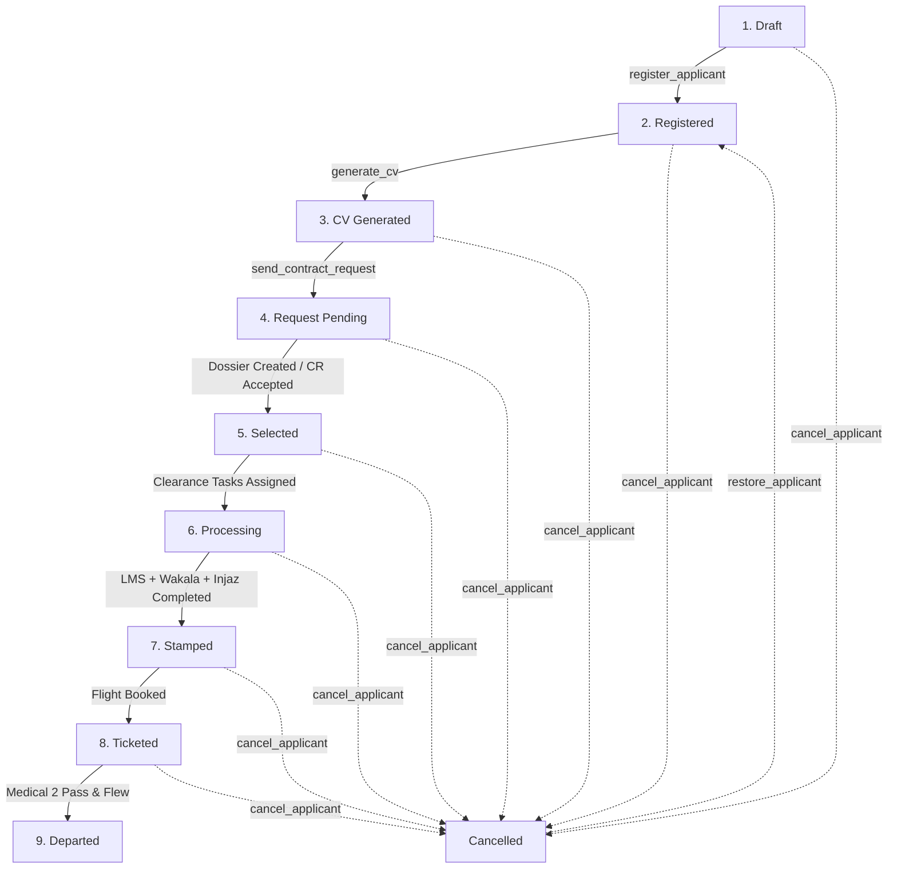

# Applicant Processing System - Frontend Developer & Postman API Guide

**Base Production URL:** `https://applicantprocessing-production.up.railway.app/`  
**Backend Framework:** Frappe Framework v15 (Python / MariaDB / REST RPC)  
**Version:** 1.0.0 (Production)  
**Authentication:** Token Auth (`token <api_key>:<api_secret>`) or Session Cookie (`sid`)

---

# Table of Contents
1. [Project Overview & Architecture](#1-project-overview--architecture)
2. [9-Stage Pipeline & State Machine](#2-9-stage-pipeline--state-machine)
3. [Domain Entities & Data Dictionary](#3-domain-entities--data-dictionary)
4. [Authentication & Global Headers](#4-authentication--global-headers)
5. [Postman-Style API Reference](#5-postman-style-api-reference)
   - [5.1. Authentication & Session](#51-authentication--session)
   - [5.2. Applicant Management & Lifecycle RPCs](#52-applicant-management--lifecycle-rpcs)
   - [5.3. CV Generation & PDF Export](#53-cv-generation--pdf-export)
   - [5.4. Contractor & Contract Requests (Single & Batch WhatsApp)](#54-contractor--contract-requests-single--batch-whatsapp)
   - [5.5. Dossier & Automated OCR Parsing](#55-dossier--automated-ocr-parsing)
   - [5.6. Clearances (LMS, Wakala, Injaz)](#56-clearances-lms-wakala-injaz)
   - [5.7. Pre-Departure Operations (Stamp, Ticket, Departure)](#57-pre-departure-operations-stamp-ticket-departure)
   - [5.8. Universal Financial Ledger & Accounting Dashboard](#58-universal-financial-ledger--accounting-dashboard)
   - [5.9. File Uploads (Photos & Documents)](#59-file-uploads-photos--documents)
   - [5.10. Document Parsing Service Hooks](#510-document-parsing-service-hooks)
6. [Frontend UI/UX Implementation Guidelines](#6-frontend-uiux-implementation-guidelines)
7. [Error Handling & Server Message Formats](#7-error-handling--server-message-formats)

---

# 1. Project Overview & Architecture

The **Applicant Processing System** automates the recruitment, document verification, embassy clearance, and international flight dispatching of domestic and skilled workers (Ethiopia $\rightarrow$ Gulf Region / Saudi Arabia).

### Core Architectural Features:
* **Progressive Validation Engine:** Enforces a light data floor for saving drafts, and strict governmental/medical prerequisites before registering or generating CVs.
* **Jinja2 + wkhtmltopdf Engine:** Generates official 2-page bilateral recruitment CVs with embedded images, QR codes, and passport scans.
* **Direct Meta WhatsApp Cloud API & Web Dispatch:** Dispatches PDF resumes directly into contractor WhatsApp conversations or provides one-click WhatsApp Web deep-links.
* **Unified Accounting Ledger:** Universal `Income Expense Log` embedded in every pipeline stage for real-time tracking of fees, margins, and consular expenses.
* **Automated Clearance Synchronization:** Coordinates clearances between LMS (Labor Ministry), Wakala (Power of Attorney), and Injaz (Saudi Visa System).
* **Automated Expiry Watchdogs:** Daily cron alerts for medical validity $\le 16$ days via in-app `ToDo` tasks and `Notification Log` alerts.

---

# 2. 9-Stage Pipeline & State Machine



### State Progression Matrix
| Step | State Name | Progress % | Required Action / Transition Rule |
| :---: | :--- | :---: | :--- |
| **1** | `Draft` | **11.1%** | Initial data entry floor (Name, Gender, Religion, Civil Status, Children, Nationality, Phone, City, Country). |
| **2** | `Registered` | **22.2%** | Triggered via `register_applicant`. Requires Passport, DOB, Education, Job Applied, Photo/Passport scans, Medical `FIT`. |
| **3** | `CV Generated` | **33.3%** | Triggered via `generate_cv`. Generates 2-page PDF and archives `CV Record`. |
| **4** | `Request Pending` | **44.4%** | Triggered via `send_contract_request` or `batch_send_contract_requests`. Contract request dispatched to contractor. |
| **5** | `Selected` | **55.6** | Triggered when `Applicant Dossier` is created/parsed or `Contract Request` is marked `Accepted`. |
| **6** | `Processing` | **66.7%** | Active when clearance officers are assigned to LMS, Wakala, or Injaz tasks. |
| **7** | `Stamped` | **77.8%** | Embassy visa stamp issued in `DSR Stamp`. Blocked if any clearance is incomplete. |
| **8** | `Ticketed` | **88.9%** | Airline ticket booked in `DSR Ticket`. Blocked if any clearance is incomplete. |
| **9** | `Departed` | **100.0%** | Final stage. Candidate passed Pre-Departure Medical 2 and departed origin airport. |
| **—** | `Cancelled` | **0.0%** | Aborted with cancellation remarks. Can be restored via `restore_applicant`. |

---

# 3. Domain Entities & Data Dictionary

### 3.1. `Applicant` (`APP-.#####`)
| Field Name | Type | Options / Choices | Required | Description |
| :--- | :--- | :--- | :---: | :--- |
| `name` | String | Auto (`APP-00001`) | Read-Only | Primary ID |
| `first_name` | String | — | **Yes (Draft)** | Given Name |
| `middle_name` | String | — | No | Father's Name |
| `last_name` | String | — | **Yes (Draft)** | Grandfather's Name |
| `full_name` | String | Auto-computed | Read-Only | Concatenation of First, Middle, Last |
| `gender` | Select | `["Female", "Male", "Other"]` | **Yes (Draft)** | Gender |
| `religion` | Select | `["Muslim", "Non-Muslim", "Orthodox", "Protestant", "Catholic", "Other"]` | **Yes (Draft)** | Religion |
| `marital_status`| Select | `["Single", "Married", "Divorced", "Widowed"]` | **Yes (Draft)** | Marital Status |
| `children` | Integer| — | **Yes (Draft)** | Count of dependent children (0 if none) |
| `nationality` | Link | `Country` (e.g. `"Ethiopia"`) | **Yes (Draft)** | Nationality |
| `phone_number` | String | — | **Yes (Draft)** | Primary Phone |
| `city` | String | — | **Yes (Draft)** | Residential City |
| `country` | String | — | **Yes (Draft)** | Residential Country |
| `date_of_birth` | Date | `YYYY-MM-DD` | **Yes (Reg)** | Cannot be future date |
| `age` | Integer| Auto-computed | Read-Only | Calculated from DOB |
| `passport_number`| String| Uppercase | **Yes (Reg)** | Passport Number |
| `passport_issue_date`| Date | `YYYY-MM-DD` | **Yes (Reg)** | Passport Issue Date |
| `passport_expiry`| Date | `YYYY-MM-DD` | **Yes (Reg)** | Passport Expiration Date |
| `place_of_issue`| String| — | **Yes (Reg)** | Passport Place of Issue |
| `job_applied` | String | e.g. `"House Maid"` | **Yes (Reg)** | Position applied for |
| `highest_education`| Select | `["Primary School", "Middle School", "High School", "Diploma", "Bachelor's Degree", "Other"]` | **Yes (Reg)** | Qualification |
| `photo_passport`| Attach | Image URL | **Yes (Reg)** | Passport portrait photo (2x2) |
| `photo_full_body`| Attach | Image URL | **Yes (Reg)** | Standing full body photo |
| `passport_scan` | Attach | Image URL | **Yes (Reg)** | Scanned Passport Page copy |
| `coc_status` | Select | `["Pending", "Issued"]` | No | Certificate of Competence |
| `exam_date` | Date | `YYYY-MM-DD` | No | COC Exam Date |
| `exam_remaining_days`| Integer| Auto-computed | Read-Only | Days remaining until exam |
| `medical_status`| Select | `["FIT", "UNFIT", "Pending"]` | **Yes (Reg)** | If `UNFIT`, registration is blocked |
| `medical_expiry_date`| Date | `YYYY-MM-DD` | **Yes (Reg)** | Medical certificate expiration |
| `medical_remaining_days`| Integer| Auto-computed | Read-Only | Days remaining until medical expiry |
| `applicant_state`| Select | Pipeline States | Read-Only | Current State |
| `state_step` | String | e.g. `"2 of 9"` | Read-Only | Step Indicator |
| `state_progress`| Percent| `0` - `100` | Read-Only | Percentage Progress |
| `total_income` | Currency | Auto-sum | Read-Only | Sum of child Income logs |
| `total_expense`| Currency | Auto-sum | Read-Only | Sum of child Expense logs |
| `net_balance` | Currency | Auto-sum | Read-Only | Total Income - Total Expense |
| `income_expense_logs`| Table | Child: `Income Expense Log` | No | Financial transaction rows |

---

# 4. Authentication & Global Headers

### Option 1: API Key / Secret Token (Recommended for SPA / Mobile Apps)
```http
Authorization: token 8a7b6c5d4e3f2a1:9z8y7x6w5v4u3t2
Content-Type: application/json
Accept: application/json
```

### Option 2: Session Cookie (Browser Login)
```http
POST /api/method/login
Content-Type: application/json

{
  "usr": "admin@example.com",
  "pwd": "YourPasswordHere"
}
```
*Stores `sid` cookie in browser for subsequent requests.*

---

# 5. Postman-Style API Reference

---

## 5.1. Authentication & Session

### `POST` Login & Acquire Session
**URL:** `https://applicantprocessing-production.up.railway.app/api/method/login`

#### Headers
| Key | Value |
| :--- | :--- |
| `Content-Type` | `application/json` |

#### Request Body
```json
{
  "usr": "admin@example.com",
  "pwd": "SecurePassword123"
}
```

#### Responses
* **`200 OK`**
```json
{
  "message": "Logged In",
  "home_page": "/app",
  "full_name": "Administrator"
}
```
* **`401 Unauthorized`**
```json
{
  "exc": "...",
  "_server_messages": "[\"Invalid login credentials\"]"
}
```

---

### `GET` Current Logged-in User Info
**URL:** `https://applicantprocessing-production.up.railway.app/api/method/frappe.auth.get_logged_user`

#### Headers
| Key | Value |
| :--- | :--- |
| `Authorization` | `token <api_key>:<api_secret>` |

#### Responses
* **`200 OK`**
```json
{
  "message": "admin@example.com"
}
```

---

## 5.2. Applicant Management & Lifecycle RPCs

### `GET` List Applicants (Filtered & Paginated)
**URL:** `https://applicantprocessing-production.up.railway.app/api/resource/Applicant`

#### Headers
| Key | Value |
| :--- | :--- |
| `Authorization` | `token <api_key>:<api_secret>` |

#### Query Parameters
| Parameter | Type | Example | Description |
| :--- | :--- | :--- | :--- |
| `fields` | String (JSON Array) | `["name","full_name","applicant_state","passport_number","medical_remaining_days","phone_number"]` | Fields to return |
| `filters` | String (JSON Array) | `[["applicant_state","=","Processing"],["gender","=","Female"]]` | Filter criteria |
| `order_by` | String | `creation desc` | Sorting field & direction |
| `limit_start` | Integer | `0` | Offset pagination start |
| `limit_page_length` | Integer | `20` | Page size |

#### Request Example (cURL)
```bash
curl -X GET "https://applicantprocessing-production.up.railway.app/api/resource/Applicant?fields=\[\"name\",\"full_name\",\"applicant_state\",\"passport_number\",\"medical_remaining_days\"\]&order_by=modified%20desc&limit_page_length=10" \
  -H "Authorization: token <api_key>:<api_secret>"
```

#### Responses
* **`200 OK`**
```json
{
  "data": [
    {
      "name": "APP-00001",
      "full_name": "Fatima Ahmed Hassen",
      "applicant_state": "Processing",
      "passport_number": "EP1234567",
      "medical_remaining_days": 42
    },
    {
      "name": "APP-00002",
      "full_name": "Abebech Tadesse Bekele",
      "applicant_state": "Registered",
      "passport_number": "EP7654321",
      "medical_remaining_days": 12
    }
  ]
}
```

---

### `GET` Retrieve Single Applicant Details (with Sub-Tables)
**URL:** `https://applicantprocessing-production.up.railway.app/api/resource/Applicant/{applicant_id}`

#### Example: `GET https://applicantprocessing-production.up.railway.app/api/resource/Applicant/APP-00001`

#### Responses
* **`200 OK`**
```json
{
  "data": {
    "name": "APP-00001",
    "first_name": "Fatima",
    "middle_name": "Ahmed",
    "last_name": "Hassen",
    "full_name": "Fatima Ahmed Hassen",
    "gender": "Female",
    "religion": "Muslim",
    "marital_status": "Single",
    "children": 0,
    "nationality": "Ethiopia",
    "phone_number": "+251911223344",
    "date_of_birth": "1998-05-14",
    "age": 28,
    "passport_number": "EP1234567",
    "passport_issue_date": "2024-01-10",
    "passport_expiry": "2029-01-09",
    "place_of_issue": "ADDIS ABABA",
    "job_applied": "House Maid",
    "highest_education": "High School",
    "english_level": "Basic",
    "arabic_level": "Fair",
    "photo_passport": "/files/photo_APP-00001.jpg",
    "photo_full_body": "/files/full_body_APP-00001.jpg",
    "passport_scan": "/files/passport_scan_APP-00001.jpg",
    "medical_status": "FIT",
    "medical_expiry_date": "2026-09-20",
    "medical_remaining_days": 36,
    "applicant_state": "CV Generated",
    "state_step": "3 of 9",
    "state_progress": 33.3,
    "total_income": 5000.0,
    "total_expense": 1200.0,
    "net_balance": 3800.0,
    "income_expense_logs": [
      {
        "name": "09a8b7c6d5",
        "transaction_type": "Income",
        "amount": 5000.0,
        "date": "2026-08-14",
        "description": "Registration fee deposit",
        "source_doctype": "Applicant"
      }
    ]
  }
}
```

---

### `POST` Create Draft Applicant (Floor Validation)
**URL:** `https://applicantprocessing-production.up.railway.app/api/resource/Applicant`

#### Headers
| Key | Value |
| :--- | :--- |
| `Authorization` | `token <api_key>:<api_secret>` |
| `Content-Type` | `application/json` |

#### Request Body
```json
{
  "first_name": "Abebech",
  "middle_name": "Tadesse",
  "last_name": "Bekele",
  "gender": "Female",
  "religion": "Muslim",
  "marital_status": "Single",
  "children": 0,
  "nationality": "Ethiopia",
  "phone_number": "+251912345678",
  "city": "Addis Ababa",
  "country": "Ethiopia",
  "region": "Oromia",
  "job_applied": "House Maid",
  "remarks": "FED"
}
```

#### Responses
* **`200 OK (Created)`**
```json
{
  "data": {
    "name": "APP-00002",
    "full_name": "Abebech Tadesse Bekele",
    "applicant_state": "Draft",
    "state_step": "1 of 9",
    "state_progress": 11.1
  }
}
```
* **`417 Expectation Failed (Missing Draft Floor Fields)`**
```json
{
  "exc": "...",
  "_server_messages": "[\"Missing required field(s): Gender, Civil / Marital Status, City, Country\"]"
}
```

---

### `POST` Transition State: Register Applicant
**URL:** `https://applicantprocessing-production.up.railway.app/api/method/applicant_processing.applicant_processing.doctype.applicant.applicant.register_applicant`

#### Headers
| Key | Value |
| :--- | :--- |
| `Authorization` | `token <api_key>:<api_secret>` |
| `Content-Type` | `application/json` |

#### Request Body
```json
{
  "applicant_name": "APP-00002"
}
```

#### Responses
* **`200 OK`**
```json
{
  "message": "Applicant APP-00002 is now Registered."
}
```
* **`417 / 500 (Validation Failure)`**
```json
{
  "exc": "...",
  "_server_messages": "[\"Missing required field(s): Passport Number, Passport Issue Date, Passport Expiry Date, Place of Issue, Small / Passport Photo, Full Body Photo, Scanned Passport Copy, Medical Expiration Date\"]"
}
```
* **`417 (Medical UNFIT)`**
```json
{
  "exc": "...",
  "_server_messages": "[\"Cannot register applicant: Medical Status is marked as 'UNFIT'.\"]"
}
```

---

### `POST` Scan & Parse Passport (MRZ-Targeted OCR + Checksum Decoder)
**URL:** `https://applicantprocessing-production.up.railway.app/api/method/applicant_processing.applicant_processing.doctype.applicant.applicant.scan_and_populate_passport`

Extracts data from standard ICAO 9303 machine-readable travel documents (Passports, ID cards) using targeted ROI OCR and the 7-3-1 weight checksum decoder with self-correcting character substitution.

#### Request Body
```json
{
  "file_url": "/files/passport_scan_APP-00002.jpg",
  "applicant_name": "APP-00002"
}
```
*(Alternatively, pass `raw_mrz_text` string if parsing pre-extracted MRZ lines).*

#### Responses
* **`200 OK`**
```json
{
  "message": {
    "status": "success",
    "message": "Passport parsed successfully with checksum validation.",
    "data": {
      "format": "TD3",
      "doc_type": "Passport",
      "passport_number": "EP1234567",
      "first_name": "Fatima",
      "middle_name": "Ahmed",
      "last_name": "Hassen",
      "full_name": "Fatima Ahmed Hassen",
      "nationality": "Ethiopia",
      "nationality_code": "ETH",
      "place_of_issue": "Ethiopia",
      "date_of_birth": "1998-05-14",
      "passport_expiry": "2029-01-09",
      "gender": "Female",
      "national_id": "987654321",
      "confidence_score": 100.0,
      "checksum_validation": {
        "passport_number": { "valid": true, "clean": "EP1234567", "check": "7" },
        "date_of_birth": { "valid": true, "corrected": "980514", "check": "1" },
        "expiry_date": { "valid": true, "corrected": "290109", "check": "6" },
        "composite": { "valid": true, "check": "0" }
      }
    }
  }
}
```

---

### `POST` Cancel Applicant Process

**URL:** `https://applicantprocessing-production.up.railway.app/api/method/applicant_processing.applicant_processing.doctype.applicant.applicant.cancel_applicant`

#### Request Body
```json
{
  "applicant_name": "APP-00002",
  "cancel_remarks": "Candidate decided not to travel overseas."
}
```

#### Responses
* **`200 OK`**
```json
{
  "message": "Applicant APP-00002 process has been Cancelled."
}
```

---

### `POST` Restore Cancelled Applicant
**URL:** `https://applicantprocessing-production.up.railway.app/api/method/applicant_processing.applicant_processing.doctype.applicant.applicant.restore_applicant`

#### Request Body
```json
{
  "applicant_name": "APP-00002",
  "restore_option": "auto"
}
```
*`restore_option` values: `"auto"` (calculates current active state from clearances/tickets), `"registered"`, `"draft"`.*

#### Responses
* **`200 OK`**
```json
{
  "message": {
    "status": "success",
    "new_state": "Registered",
    "message": "Applicant APP-00002 restored to state 'Registered'."
  }
}
```

---

## 5.3. CV Generation & PDF Export

### `POST` Generate Two-Page Official CV
**URL:** `https://applicantprocessing-production.up.railway.app/api/method/applicant_processing.applicant_processing.doctype.applicant.applicant.generate_cv`

#### Headers
| Key | Value |
| :--- | :--- |
| `Authorization` | `token <api_key>:<api_secret>` |
| `Content-Type` | `application/json` |

#### Request Body
```json
{
  "applicant_name": "APP-00002"
}
```

#### Responses
* **`200 OK`**
```json
{
  "message": {
    "cv_record": "CV-00002",
    "file_url": "/private/files/CV-APP-00002-CV-00002.pdf",
    "message": "CV generated successfully: CV-00002"
  }
}
```

---

## 5.4. Contractor & Contract Requests (Single & Batch WhatsApp)

### `GET` List Contractors
**URL:** `https://applicantprocessing-production.up.railway.app/api/resource/Contractor`

#### Responses
* **`200 OK`**
```json
{
  "data": [
    {
      "name": "Al Qurashi Recruitment Office",
      "company_name": "Al Qurashi Recruitment Office",
      "contact_person": "Sheikh Mohammed Al-Qurashi",
      "phone": "+966501234567",
      "whatsapp": "+966501234567",
      "email": "info@alqurashirecruitment.com",
      "active_status": 1
    }
  ]
}
```

---

### `POST` Send Single Contract Request (Dispatches WhatsApp Cloud API)
**URL:** `https://applicantprocessing-production.up.railway.app/api/method/applicant_processing.applicant_processing.doctype.contract_request.contract_request.send_contract_request`

#### Request Body
```json
{
  "contract_request_name": "CR-00001"
}
```

#### Responses
* **`200 OK`**
```json
{
  "message": {
    "status": "success",
    "message": "Contract Request CR-00001 successfully sent to Contractor: Al Qurashi Recruitment Office (+966501234567).",
    "whatsapp_url": "https://api.whatsapp.com/send?phone=966501234567&text=Hello%20Sheikh%20Mohammed%2C%0A%0AA%20new%20Contract%20Request%20*CR-00001*%20has%20been%20sent...",
    "whatsapp_number": "966501234567",
    "whatsapp_api_sent": true,
    "whatsapp_api_message": "PDF Document sent successfully via Meta WhatsApp API (ID: wamid.HBgLMjUxOTExMjIzMzQ0FQIAERgSRjBGQzQzN0IxOEFBMEIyQUEA)",
    "contractor_name": "Al Qurashi Recruitment Office"
  }
}
```

---

### `POST` Batch Send Contract Requests (Multi-CV Dispatch)
**URL:** `https://applicantprocessing-production.up.railway.app/api/method/applicant_processing.applicant_processing.doctype.contract_request.contract_request.batch_send_contract_requests`

#### Request Body
```json
{
  "cv_references": ["CV-00001", "CV-00002", "CV-00003"],
  "contractor": "Al Qurashi Recruitment Office"
}
```

#### Responses
* **`200 OK`**
```json
{
  "message": {
    "total": 3,
    "created_count": 2,
    "sent_count": 3,
    "failed_count": 0,
    "results": [
      {
        "cv_reference": "CV-00001",
        "contract_request": "CR-00001",
        "applicant": "APP-00001",
        "status": "success",
        "details": {
          "whatsapp_api_sent": true,
          "whatsapp_url": "https://api.whatsapp.com/send?phone=966501234567..."
        }
      }
    ]
  }
}
```

---

## 5.5. Dossier & Automated OCR Parsing

### `POST` Create Applicant Dossier
**URL:** `https://applicantprocessing-production.up.railway.app/api/resource/Applicant Dossier`

#### Request Body
```json
{
  "contract_request": "CR-00001",
  "attached_file": "/files/saudi_contract_scan_001.pdf"
}
```

#### Responses
* **`200 OK`**
```json
{
  "data": {
    "name": "DOSSIER-00001",
    "applicant": "APP-00001",
    "full_name": "Fatima Ahmed Hassen",
    "contract_status": "Sent"
  }
}
```
*(Automatically creates linked `DSR-00001` and clearance sub-records in background).*

---

### `POST` Parse Contract Document File (PyMuPDF + Structured Multi-line Unification)
**URL:** `https://applicantprocessing-production.up.railway.app/api/method/applicant_processing.applicant_processing.doctype.applicant_dossier.applicant_dossier.parse_dossier_file`

Parses recruitment contracts (e.g. Saudi Musaned / bilateral employment contracts) using **PyMuPDF (`fitz`)** block layout analysis and a multi-line text structurizer that unifies wrapped text, multi-line values, and bilingual key-values.

#### Request Body
```json
{
  "dossier_name": "DOSSIER-00001"
}
```
*(Or standalone API: `POST /api/method/applicant_processing.applicant_processing.utils.contract_parser.parse_contract_document` with `file_url` or `raw_text`).*

#### Responses
* **`200 OK`**
```json
{
  "message": {
    "status": "success",
    "message": "Contract parsed successfully with PyMuPDF structured text unification.",
    "data": {
      "contract_number": "CONT-98765432",
      "visa_number": "1309827465",
      "contract_date": "2026-08-15",
      "contract_duration": "2 Years",
      "monthly_salary": "1,000 SR",
      "amount_detail": 1000.0,
      "profession": "House Maid",
      "employer_name": "Abdullah Mohammed Al-Otaibi",
      "employer_id": "1098765432",
      "employer_street": "King Fahd Road, Al Malaz",
      "employer_city": "Riyadh",
      "employer_mobile": "+966501234567",
      "employer_telephone": "+966114567890",
      "recruiting_agency_name": "Al Qurashi Recruitment Office",
      "recruiting_agency_license": "REC-7788",
      "recruiting_agency_telephone": "+966501234567",
      "recruiting_agency_street": "Olaya District",
      "recruiting_agency_city": "Riyadh",
      "recruiting_agency_email": "info@alqurashirecruitment.com",
      "origin_agency_name": "ANWAR SULTAN FOREIGN EMPLOYMENT AGENT",
      "origin_agency_license": "3226",
      "origin_agency_street": "Addis Ababa",
      "origin_agency_city": "Addis Ababa",
      "origin_agency_phone": "+251911223344",
      "origin_agency_email": "info@anwarsultanagency.com"
    }
  }
}
```


---

## 5.6. Clearances (LMS, Wakala, Injaz)

### `GET` Retrieve Clearance Statuses for a DSR
**URL:** `https://applicantprocessing-production.up.railway.app/api/resource/DSR/{dsr_id}`

#### Responses
* **`200 OK`**
```json
{
  "data": {
    "name": "DSR-00001",
    "full_name": "Fatima Ahmed Hassen",
    "lms_status": "Issued",
    "wakala_status": "Completed",
    "injaz_status": "Completed",
    "stamp_status": "Pending",
    "ticket_status": "Pending",
    "departure_status": "Pending"
  }
}
```

---

### `PUT` Update LMS Clearance & Assign Officer
**URL:** `https://applicantprocessing-production.up.railway.app/api/resource/LMS Clearance/LMS-00001`

#### Request Body
```json
{
  "employee": "lms_officer@agency.com",
  "status": "Issued",
  "issued_on": "2026-08-15"
}
```

#### Responses
* **`200 OK`**
```json
{
  "data": {
    "name": "LMS-00001",
    "status": "Issued",
    "issued_on": "2026-08-15",
    "employee": "lms_officer@agency.com"
  }
}
```

---

### `PUT` Complete Wakala & Injaz Clearances
**URL:** `https://applicantprocessing-production.up.railway.app/api/resource/Wakala Clearance/WAK-00001`

#### Request Body
```json
{
  "status": "Completed",
  "employee": "wakala_officer@agency.com"
}
```

---

## 5.7. Pre-Departure Operations (Stamp, Ticket, Departure)

> **⚠️ Clearance Requirement:** Creating or updating Stamp, Ticket, or Departure records will return an error unless `LMS`, `Wakala`, and `Injaz` are all `Completed`/`Issued`.

### `POST` Record Visa Stamp (`DSR Stamp`)
**URL:** `https://applicantprocessing-production.up.railway.app/api/resource/DSR Stamp`

#### Request Body
```json
{
  "dsr": "DSR-00001",
  "status": "Completed",
  "stamp_number": "ST-998877",
  "stamp_date": "2026-08-15"
}
```

#### Responses
* **`200 OK`**
```json
{
  "data": {
    "name": "STAMP-00001",
    "status": "Completed",
    "stamp_number": "ST-998877"
  }
}
```
* **`417 Expectation Failed (Clearances Pending)`**
```json
{
  "exc": "...",
  "_server_messages": "[\"Cannot proceed with Stamp / Ticket / Departure. The following required clearance(s) are incomplete: Wakala Clearance, LMS Clearance. INJAZ, Wakala, and LMS clearances must ALL be completed first.\"]"
}
```

---

### `POST` Book Flight Ticket (`DSR Ticket`)
**URL:** `https://applicantprocessing-production.up.railway.app/api/resource/DSR Ticket`

#### Request Body
```json
{
  "dsr": "DSR-00001",
  "status": "Booked",
  "ticket_number": "ET-071-9876543210",
  "ticket_details": "Flight ET404 Addis Ababa (ADD) -> Riyadh (RUH), Departure: 2026-08-20 22:30"
}
```

---

### `POST` Pre-Departure Medical 2 & Final Departure (`DSR Departure`)
**URL:** `https://applicantprocessing-production.up.railway.app/api/resource/DSR Departure`

#### Request Body (Success Flow)
```json
{
  "dsr": "DSR-00001",
  "status": "Departed",
  "departure_time": "2026-08-20 22:30:00",
  "medical_2_result": "Pass",
  "medical_2_date": "2026-08-19"
}
```

#### Request Body (Failed Medical 2 Flow)
```json
{
  "dsr": "DSR-00001",
  "status": "Pending",
  "departure_time": "2026-08-20 22:30:00",
  "medical_2_result": "Fail",
  "medical_2_date": "2026-08-19",
  "medical_2_remark": "Candidate tested positive for acute infectious illness during pre-flight screening."
}
```
*(If `medical_2_result == "Fail"`, setting `status = "Departed"` is strictly blocked by the server).*

---

## 5.8. Universal Financial Ledger & Accounting Dashboard

### `GET` Complete Accounting Summary Dashboard
**URL:** `https://applicantprocessing-production.up.railway.app/api/method/applicant_processing.applicant_processing.api.get_accounting_summary`

#### Headers
| Key | Value |
| :--- | :--- |
| `Authorization` | `token <api_key>:<api_secret>` |

#### Responses
* **`200 OK`**
```json
{
  "message": {
    "total_income": 125000.0,
    "total_expense": 48200.0,
    "net_balance": 76800.0,
    "transaction_count": 64,
    "by_stage": [
      {
        "stage": "Applicant",
        "income": 75000.0,
        "expense": 12000.0,
        "net": 63000.0,
        "count": 30
      },
      {
        "stage": "DSR Stamp",
        "income": 0.0,
        "expense": 18000.0,
        "net": -18000.0,
        "count": 15
      },
      {
        "stage": "DSR Ticket",
        "income": 50000.0,
        "expense": 18200.0,
        "net": 31800.0,
        "count": 19
      }
    ],
    "per_applicant": [
      {
        "applicant": "APP-00001",
        "applicant_name": "Fatima Ahmed Hassen",
        "income": 15000.0,
        "expense": 4200.0,
        "net": 10800.0
      }
    ],
    "recent_transactions": [
      {
        "name": "09a8b7c6d5",
        "applicant": "APP-00001",
        "applicant_name": "Fatima Ahmed Hassen",
        "stage": "DSR Stamp",
        "transaction_type": "Expense",
        "amount": 1200.0,
        "date": "2026-08-15",
        "description": "Embassy visa stamping consular fee",
        "source_doctype": "DSR Stamp"
      }
    ]
  }
}
```

---

## 5.9. File Uploads (Photos & Documents)

### `POST` Upload Document / Photo Binary
**URL:** `https://applicantprocessing-production.up.railway.app/api/method/upload_file`

#### Headers
| Key | Value |
| :--- | :--- |
| `Authorization` | `token <api_key>:<api_secret>` |
| `Content-Type` | `multipart/form-data` |

#### Form-Data Parameters
| Key | Type | Example | Description |
| :--- | :--- | :--- | :--- |
| `file` | File Binary | `[photo.jpg]` | File content |
| `is_private` | Integer | `0` (public) or `1` (private) | Access control |
| `doctype` | String | `Applicant` | Target DocType |
| `docname` | String | `APP-00001` | Target Document ID |
| `fieldname` | String | `passport_scan` | Target Field Name |

#### Responses
* **`200 OK`**
```json
{
  "message": {
    "file_url": "/files/passport_scan_APP-00001.jpg",
    "name": "09f8e7d6c5",
    "file_name": "passport_scan_APP-00001.jpg"
  }
}
```

---

## 5.10. Document Parsing Service Hooks

For automated OCR extraction microservices:
1. **Fetch pending documents needing OCR:**  
   `GET /api/method/applicant_processing.applicant_processing.api.get_pending_documents?limit=10`
2. **Submit extracted data payload back to server:**  
   `POST /api/method/applicant_processing.applicant_processing.api.update_extracted_data`
   ```json
   {
     "parse_request_name": "PR-00001",
     "extracted_data": {
       "passport_number": "EP1234567",
       "date_of_birth": "1998-05-14",
       "expiry_date": "2029-01-09"
     },
     "status": "Completed"
   }
   ```

---

# 6. Frontend UI/UX Implementation Guidelines

### 1. Progressive Action Bar (Draft vs Register)
* **"Save Draft" button:** Validates only the 10 Draft-floor fields.
* **"Register Applicant" button:** Triggers pre-validation modal checking DOB, Passport scan, Photos, Job applied, and Medical Fitness.
* **Medical Fitness Banner:** If `medical_status === "UNFIT"`, disable the **Register** and **Generate CV** buttons, rendering:  
  *⚠️ "Applicant cannot be registered while medical status is UNFIT."*

### 2. Reactive Date Expiration Badges
Calculate badge colors dynamically on date pickers without requiring backend round-trips:
* 🟢 **> 30 Days Remaining:** `badge-success` (Green)
* 🟡 **10–30 Days Remaining:** `badge-warning` (Yellow)
* 🔴 **$\le$ 16 Days Remaining:** `badge-danger` (Pulsing Red - triggers system alerts)
* ❌ **$\le$ 0 Days Remaining:** `badge-critical` (Expired)

### 3. Clearance Stepper & Pre-Departure Guardrails
On the `DSR Stamp`, `Ticket`, and `Departure` views, render a 3-step visual indicator for `Injaz`, `Wakala`, and `LMS`. If any are incomplete, disable the creation form and display:  
*⛔ "All 3 Clearances (Injaz, Wakala, LMS) must be completed before issuing Stamps or Tickets."*

### 4. Interactive WhatsApp Dispatch
When a Contract Request is dispatched:
* If `whatsapp_api_sent === true`, display: *✅ "CV PDF sent directly to Contractor WhatsApp."*
* Always provide the fallback `whatsapp_url` as an action button: **"Open in WhatsApp Web"** (`target="_blank"`).

---

# 7. Error Handling & Server Message Formats

Frappe returns errors as JSON envelopes with an HTTP status code (`400`, `403`, `417`, or `500`):

```json
{
  "exc": "[\"Traceback (most recent call last): ... \"]",
  "_server_messages": "[\"{\\\"message\\\": \\\"Cannot register applicant: Medical Status is marked as 'UNFIT'.\\\", \\\"title\\\": \\\"Message\\\", \\\"indicator\\\": \\\"red\\\"}\"]"
}
```

### Frontend Error Parser Utility (TypeScript/JavaScript Example):
```typescript
export function extractFrappeError(errorResponse: any): string {
  if (errorResponse?._server_messages) {
    try {
      const messages = JSON.parse(errorResponse._server_messages);
      const parsed = JSON.parse(messages[0]);
      return parsed.message || parsed;
    } catch {
      return errorResponse._server_messages;
    }
  }
  return errorResponse?.message || "An unexpected error occurred.";
}
```
