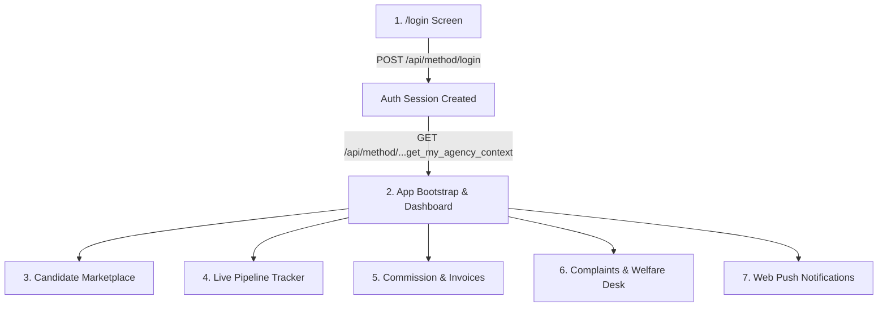

# Custom Frontend Integration & API Guide (Headless Backend)

This document is the **official implementation guide** for the Frontend Engineering team building the custom web/mobile frontend for the **Applicant Processing System & Foreign Agency Portal**.

---

## 1. Architecture & Authentication Overview

* **Backend Type:** Headless Frappe REST API.
* **Authentication Method:** Session Cookie (`sid`) via Email + Password.
* **No API Keys Needed:** End-users and foreign agencies log in with their standard email and password.
* **CORS & Credentials:** Every HTTP client call (`axios` or `fetch`) **MUST** include `withCredentials: true` (or `credentials: 'include'`).
* **Multi-Tenancy & Security:** The backend automatically identifies the caller's linked agency from `frappe.session.user`. Agency users are strictly isolated and cannot view, select, or access data belonging to other agencies.

---

## 2. Quickstart HTTP Client Setup (React / Next.js / Vue / TypeScript)

```typescript
import axios from 'axios';

export const api = axios.create({
  baseURL: process.env.NEXT_PUBLIC_BACKEND_URL || 'http://localhost:8000',
  withCredentials: true, // <-- CRITICAL: Sends and persists session cookies
  headers: {
    'Accept': 'application/json',
    'Content-Type': 'application/json'
  }
});
```

---

## 3. Core Frontend Flows & API Endpoints



---

### Module 1: Authentication & Bootstrap

#### 1.1 Login
```http
POST /api/method/login
Content-Type: application/json

{
  "usr": "agency@example.com",
  "pwd": "YourPassword123"
}
```
* **Response (HTTP 200):**
  ```json
  {
    "message": "Logged In",
    "full_name": "Tutu Recruitment Agency",
    "home_page": "/app"
  }
  ```

#### 1.2 App Bootstrap (`get_my_agency_context`)
Call this **once on app startup** (or in your global auth provider). Returns logged-in user profile, linked Contractor details, country, currency, VAPID public key for Web Push, and stats in **1 single call**:

```http
GET /api/method/applicant_processing.applicant_processing.api.get_my_agency_context
```
* **Response:**
  ```json
  {
    "message": {
      "user": "agency@example.com",
      "full_name": "Tutu Recruitment Agency",
      "roles": ["Foreign Agency"],
      "is_internal_staff": false,
      "contractor": {
        "name": "Tutu",
        "company_name": "Tutu Overseas Employment",
        "country": "Saudi Arabia",
        "contact_person": "Ali Hassan",
        "phone": "+966 50 123 4567",
        "email": "agency@example.com",
        "default_commission_amount": 1500.0,
        "default_commission_currency": "SAR",
        "active_status": 1
      },
      "vapid_public_key": "BEl62iUYgUivxI...",
      "portal_stats": {
        "available_candidates": 45,
        "my_selected_candidates": 8,
        "open_complaints": 1,
        "contractor": "Tutu"
      }
    }
  }
  ```

#### 1.3 Logout
```http
POST /api/method/logout
```

---

### Module 2: Candidate Marketplace (Available Talent Pool)

**Business Rule:** Only candidates who are unreserved (`locked_contractor IS NULL`) or reserved by the current agency appear here. If a candidate is selected or a Musaned contract is parsed for them, they are **instantly removed** from other agencies' view.

#### 2.1 Browse Available Candidates
```http
GET /api/method/applicant_processing.applicant_processing.api.get_portal_available_candidates
  ?destination_country=Saudi Arabia
  &job_applied=Housemaid
  &religion=Muslim
  &limit=50
```
* **Returns:** Array of candidate cards with `photo_passport`, `photo_full_body`, skill flags, salary, and `cv_file_url` (direct CV PDF download).

#### 2.2 Candidate Full Detail Profile (`get_agency_candidate_detail`)
When an agency clicks on a candidate to view full bio, medical, work history, and dossier before locking:
```http
GET /api/method/applicant_processing.applicant_processing.api.get_agency_candidate_detail?applicant_id=APP-00123
```
* **Returns:** Complete profile with structured skills, experience history, passport details, and lock status.
* *Note:* If locked by another agency, returns `403 PermissionError`.

#### 2.3 Select / Reserve Candidate (Atomic Row Lock)
```http
POST /api/method/applicant_processing.applicant_processing.api.portal_select_candidate
Content-Type: application/json

{
  "applicant_id": "APP-00123"
}
```
* **Concurrency-Safe:** Uses `SELECT FOR UPDATE`. If 2 agencies click simultaneously, only the first succeeds. The second receives `DuplicateEntryError`.

#### 2.4 Release Candidate (Cancel Reservation)
```http
POST /api/method/applicant_processing.applicant_processing.api.portal_release_candidate
Content-Type: application/json

{
  "applicant_id": "APP-00123"
}
```

---

### Module 3: Live Pipeline Tracker (My Candidates)

#### 3.1 Get Pipeline Candidates (`get_agency_pipeline_candidates`)
Shows candidates assigned to your agency with live recruitment milestones (Contract, Ticket, Departure):
```http
GET /api/method/applicant_processing.applicant_processing.api.get_agency_pipeline_candidates?stage=all&limit=50
```
* **`stage` filter options:** `all` | `Selected` | `Processing` | `Stamped` | `Ticketed` | `Departed`
* **Response item fields:**
  * `dossier_name`, `sponsor_name`, `visa_number`, `contract_date`, `contract_duration`
  * `airline`, `flight_number`, `flight_date`, `route`, `ticket_status`
  * `departure_time`, `departure_status`
  * `cv_file_url`

---

### Module 4: Commission Billing & Statements

#### 4.1 Commission Summary Banner
```http
GET /api/method/applicant_processing.applicant_processing.utils.commission_export.get_unpaid_commission_summary
```
* **Returns:** Total departed count, agreed rate per candidate, total outstanding amount, currency.

#### 4.2 Candidate Billing Table
```http
GET /api/method/applicant_processing.applicant_processing.utils.commission_export.get_unpaid_commission_candidates_list?limit=30
```

#### 4.3 Direct Statement Downloads
Open these URLs in a new browser tab (or window) to trigger instant file download:

* **Excel Spreadsheet (.xlsx):**
  ```
  GET /api/method/applicant_processing.applicant_processing.utils.commission_export.export_unpaid_commission_report?export_format=excel&limit=30
  ```
* **PDF Billing Invoice:**
  ```
  GET /api/method/applicant_processing.applicant_processing.utils.commission_export.export_unpaid_commission_report?export_format=pdf&limit=30
  ```

---

### Module 5: Complaints & Welfare Desk

#### 5.1 View Agency Complaints
```http
GET /api/method/applicant_processing.applicant_processing.api.get_agency_complaints?tab=unresolved
```
* **`tab` options:** `unresolved` (default, oldest first with `days_unresolved`) | `new` | `resolved`

#### 5.2 Worker Autocomplete Search (for Complaint Form)
Restricted strictly to workers associated with your agency:
```http
GET /api/method/applicant_processing.applicant_processing.api.search_applicants_for_complaint?query=Amara
```

#### 5.3 Submit a Complaint
```http
POST /api/method/applicant_processing.applicant_processing.api.submit_agency_complaint
Content-Type: application/json

{
  "applicant_search": "APP-00123",
  "complaint_category": "Runaway",
  "complaint_details": "Worker left employer house without notice on 2026-08-10.",
  "severity": "High"
}
```
* **`complaint_category` options:** `Runaway` | `Non-Performance` | `Employer Abuse` | `Medical` | `Legal` | `Other`
* **`severity` options:** `Low` | `Medium` | `High` | `Critical`

---

### Module 6: Web Push Notifications

When the user logs in on the custom frontend:
1. Frontend registers Service Worker (`public/sw.js`).
2. Frontend requests browser permission (`Notification.requestPermission()`).
3. Frontend subscribes using `vapid_public_key` obtained from `get_my_agency_context`.
4. Frontend posts subscription to backend:
```http
POST /api/method/applicant_processing.applicant_processing.utils.push_api.subscribe_web_push
Content-Type: application/json

{
  "subscription_data": {
    "endpoint": "https://fcm.googleapis.com/fcm/send/...",
    "keys": {
      "p256dh": "...",
      "auth": "..."
    }
  }
}
```

---

## 4. Error Handling Conventions

All endpoints return standard JSON error responses on failure:

```json
{
  "exc_type": "PermissionError",
  "exception": "PermissionError: This candidate has been reserved by another partner agency.",
  "_server_messages": "[\"{\\\"message\\\": \\\"This candidate has been reserved by another partner agency.\\\"}\"]"
}
```

* **401 Unauthorized:** Session expired or user not logged in $\rightarrow$ redirect to `/login`.
* **403 Forbidden:** User attempted to access unauthorized or another agency's data $\rightarrow$ display alert toast.
* **409 Conflict (`DuplicateEntryError`):** Candidate was reserved by another agency in a race condition $\rightarrow$ prompt to select another candidate.
