# Software Requirements Specification (SRS)
## End-to-End Overseas Recruitment & Applicant Processing System (Multi-Country Platform)

* **System Name:** FairValue / Overseas Applicant Processing System (APS)
* **Document Version:** 5.2.0 (Human-Centric & Flexible Operations: Manager Override Audit Valves, Batch Action Workbenches, Forgiving State Rollbacks, and On-Demand Multi-Channel Dispatches)
* **Scope:** Overseas Domestic & Skilled Worker Recruitment Lifecycle (Ethiopia $\rightarrow$ Kingdom of Saudi Arabia & State of Kuwait Corridors + Multi-Country GCC Extensibility)
* **Target Platform:** Frappe Framework v15 / Python 3.11+ / MariaDB 10.6+ / Redis / Docker / Linux
* **Status:** Approved / Specification Baseline

---

# 0. Complete End-to-End System Architecture & Clearance Flow

```mermaid
flowchart TD
    %% ==========================================
    %% INTAKE & REGISTRATION
    %% ==========================================
    subgraph P1["PHASE 1: Intake & Dual-Track Registration"]
        W["Candidate Walk-In"] --> TypeSelect{"Select Applicant Type<br/>(Standard vs Muayena)"}
        
        TypeSelect -->|Standard| S1["Stage 1: Draft<br/>(Bare Minimum Floor)"]
        S1 --> S2["Stage 2: Registered<br/>(FIN, Labour ID, Religion, Salary, Country, Initial Medical FIT)"]
        S2 --> S3["Stage 3: CV Generated<br/>(2-Page Bilateral PDF Generated & Listed on Agency Portal)"]
        S3 --> AgencySelect["Foreign Agency Selects Candidate & Issues Contract"]
        
        TypeSelect -->|Muayena| MuayenaDirect["Muayena / Direct Name Hire<br/>(Candidate already selected & contract ready)"]
    end

    AgencySelect --> UploadContract["Local Employee Uploads Contract PDF<br/>(Musaned for KSA / Standard Contract for Kuwait)"]
    MuayenaDirect --> UploadContract

    %% ==========================================
    %% DOSSIER INITIALIZATION & MEDICAL VALIDATION
    %% ==========================================
    subgraph P2["PHASE 2: Dossier Creation & Medical Expiry Check"]
        UploadContract --> ContractParser["Contract Document Parsing Engine<br/>(Pluggable Extractor Engine)"]
        ContractParser --> S4["Stage 4: Selected / Applicant Dossier<br/>(Master DSR Initialized with destination_country + Elapsed Days Counter Starts)"]
        
        S4 --> MedCheck{"Is GAMCA Medical Still Valid?<br/>(Check Expiry Date vs Today)"}
        
        MedCheck -->|Medical Expired while waiting for Contract| MedRenewal["LMIS Officer Action:<br/>*Request Medical Renewal / Re-test*<br/>*7-10 Day Inactivity Watchdog Triggered*"]
        MedCheck -->|Medical Still Valid| S5["Stage 5: Processing"]
        MedRenewal --> S5
    end

    %% ==========================================
    %% DYNAMIC CLEARANCE PIPELINE (KSA vs KUWAIT)
    %% ==========================================
    subgraph P3["PHASE 3: Dynamic Government Clearance Engine & Overrides"]
        S5 --> CorridorRouter{"Route by Destination Country"}
        
        %% KSA Corridor
        subgraph CORRIDOR_KSA["Corridor A: Saudi Arabia (KSA) Pipeline"]
            CorridorRouter -->|destination_country == 'Saudi Arabia'| KSA_LMIS["1. LMIS Clearance<br/>(MoL Quota & Contract Approval)<br/>*Auto-Posts Agency Commission into Ledger on Issuance*"]
            
            CorridorRouter -->|destination_country == 'Saudi Arabia'| KSA_Taeshir["2. Taeshir / Tasheer Process<br/>(Biometrics Fingerprinting & Appointment)"]
            
            subgraph KSA_TAESHIR_GATE["Inside Taeshir: Injaz Payment Gate"]
                KSA_Taeshir --> KSA_InjazFitCheck{"Is Applicant Medical FIT?"}
                KSA_InjazFitCheck -->|Medical FIT| KSA_InjazPay["Injaz Payment Executed<br/>(Saudi Consular Visa & Insurance Fee)"]
                KSA_InjazFitCheck -->|UNFIT / NOT FIT| KSA_BlockInjaz["STRICTLY BLOCKED<br/>(Process Cannot Continue)"]
                KSA_BlockInjaz --> KSA_CancelBtn["Cancel Applicant Action<br/>*(Rollback / Undo Available with Reason)*"]
            end
            
            KSA_InjazPay --> KSA_TaeshirDone["Taeshir Biometrics & Injaz Completed"]
            
            subgraph KSA_EMBASSY_PROCESS["3. Embassy Process (Includes Wakala)"]
                KSA_TaeshirDone --> KSA_WakalaCron["Monday & Thursday Automated Reminder Cron<br/>*(+ On-Demand 'Send WhatsApp/Push Now' Buttons)*"]
                KSA_WakalaCron --> KSA_PushAlert["1. Push API Text Notification to Foreign Agency Portal"]
                KSA_WakalaCron --> KSA_WaAlert["2. WhatsApp Text Reminder Message to Agency Phone"]
                
                KSA_PushAlert & KSA_WaAlert --> KSA_AgencyPaysWakala["Foreign Agency Pays Wakala on Musaned"]
                KSA_AgencyPaysWakala --> KSA_EmployeeVerifies["Local Employee Verifies Payment & Updates Status to 'Paid'"]
                KSA_EmployeeVerifies --> KSA_VisaStamping["Embassy Physical Visa Stamping"]
            end
        end

        %% Kuwait Corridor
        subgraph CORRIDOR_KWT["Corridor B: Kuwait Pipeline (No Musaned / No Wakala)"]
            CorridorRouter -->|destination_country == 'Kuwait'| KWT_Police["1. LMIS Police Clearance (Ashera)<br/>(Police Clearance Certificate & LMIS Registration)"]
            
            KWT_Police --> KWT_Telesign["2. Telesign Online Document Auth<br/>(Authenticate Documents Online via Telesign)"]
            
            KWT_Telesign --> KWT_Embassy["3. Kuwait Embassy Submission & Payment<br/>(Consular Document Filing, Payment & Visa Approval)"]
            
            KWT_Embassy --> KWT_LMIS_Permit["4. LMIS Work Permit Issuance<br/>(Final Labor Security Clearance & Work Permit on LMIS)<br/>*Auto-Posts Agency Commission into Ledger on Issuance*"]
        end
        
        KSA_LMIS & KSA_VisaStamping --> AllClearGate{"Clearance Synchronization Gate<br/>*(Manager Exception Override Available)*"}
        KWT_LMIS_Permit --> AllClearGate
    end

    %% ==========================================
    %% TICKETING, FLIGHT RESCHEDULING & DISPATCH
    %% ==========================================
    subgraph P4["PHASE 4: Ticketing, Flight Rescheduling & Batch Operations"]
        AllClearGate -->|All Completed or Override Granted| S6["Stage 6: Stamped<br/>(Embassy Visa Stamp Verified in DSR)"]
        S6 --> S7["Stage 7: Ticketed<br/>(Flight Date & Airline Route Booked)"]
        
        subgraph FLIGHT_MGMT["Flight Management & Rescheduling Lifecycle"]
            S7 --> FlightActions{"Flight Status Options<br/>*(Batch Actions Supported)*"}
            FlightActions -->|Flight On Schedule| Med2Screening["Pre-Departure Medical 2 Screening<br/>(Within 72h of Flight Date - FIT TO FLY)"]
            FlightActions -->|Reschedule Flight| RescheduleAction["Reschedule Flight Date<br/>*Updates Departure Date & Logs History*<br/>*Re-aligns 72h Medical 2 Window*"]
            FlightActions -->|Cancel Ticket / Undo| CancelTicketAction["Cancel Flight Ticket<br/>*Mandatory Cancellation Reason*<br/>*Reverts to Stamped / Ready for New Date*"]
            
            RescheduleAction --> S7
            CancelTicketAction --> S6
        end
        
        Med2Screening -->|Medical 2 PASS| S8["Stage 8: Departed<br/>(Airport Flight Confirmed - 100% Complete)"]
        Med2Screening -->|Medical 2 FAIL| FlightBlocked["Flight Cancelled & Departure Blocked"]
    end

    %% ==========================================
    %% WELFARE, COMPLAINTS & 3-MONTH REPLACEMENT GUARANTEE
    %% ==========================================
    subgraph P5["PHASE 5: Welfare, Agency Complaints & 3-Month Return Guarantee"]
        S8 --> Watchdogs["Automated Business Watchdogs<br/>- Contract Elapsed Days Counter<br/>- Multi-Tier Medical Expiry (14d, 10d, 7d, 3d, 1d)<br/>- 3-Month Free Replacement Window Tracker"]
        
        ForeignAgencyPortal["Foreign Agency Portal Dashboard"] -->|Logs Complaint against Active or Departed Worker| AgencyComplaint["New Agency Complaint Logged"]
        
        AgencyComplaint --> WelfareDesk["Local Agency Welfare Queue<br/>*Tab 1: New Complaints*<br/>*Tab 2: Unresolved Complaints (Ranked by Longest Pending First)*"]
        
        WelfareDesk --> ResolutionAction{"Local Agency Investigation & Resolution"}
        ResolutionAction -->|Resolved| OutResolved["Marked 'Resolved'<br/>(Dispute settled, salary paid, reconciled)"]
        ResolutionAction -->|Worker Returned <= 3 Months| OutReturned["Marked 'Returned / Free Replacement Required'<br/>*Auto-provisions Replacement Candidate at $0 Commission*"]
        ResolutionAction -->|Escalated| OutEscalated["Marked 'Escalated'<br/>(Referred to Labor Office / Embassy)"]
    end

    %% Node Styling
    classDef stateNode fill:#e3f2fd,stroke:#1565c0,stroke-width:2px,color:#0d47a1,font-weight:bold;
    classDef gateNode fill:#fff3e0,stroke:#e65100,stroke-width:2px,color:#bf360c,font-weight:bold;
    classDef engineNode fill:#f3e5f5,stroke:#6a1b9a,stroke-width:2px,color:#4a148c;
    classDef alertNode fill:#ffebee,stroke:#c62828,stroke-width:2px,color:#b71c1c;
    classDef urgentNode fill:#ffcdd2,stroke:#b71c1c,stroke-width:3px,color:#7f0000,font-weight:bold;
    classDef successNode fill:#e8f5e9,stroke:#2e7d32,stroke-width:2px,color:#1b5e20;

    class S1,S2,S3,S4,S5,S6,S7,S8 stateNode;
    class TypeSelect,MedCheck,KSA_InjazFitCheck,CorridorRouter,AllClearGate,FlightActions,Med2Screening,ResolutionAction gateNode;
    class ContractParser engineNode;
    class KSA_BlockInjaz,FlightBlocked alertNode;
    class AgencyComplaint,WelfareDesk urgentNode;
    class MedRenewal,KSA_InjazPay,KSA_TaeshirDone,KSA_PushAlert,KSA_WaAlert,KSA_EmployeeVerifies,KSA_VisaStamping,KWT_Police,KWT_Telesign,KWT_Embassy,KWT_LMIS_Permit,RescheduleAction,OutResolved,OutReturned,Watchdogs successNode;
```

---

# 1. Dual-Track Candidate Classification: Standard vs Muayena

| Operational Dimension | Track A: Standard Applicant | Track B: Muayena (معاينة / Direct Hire) |
| :--- | :--- | :--- |
| **Exact Business Definition** | Candidate looking for an overseas employer. Needs agency sourcing, interview, CV marketing, and partner agency selection. | **Candidate who is already selected beforehand by the employer and has a contract already issued and ready to be processed.** |
| **Entry Point in System** | **Stage 1 (`Draft`)** $\rightarrow$ **Stage 2 (`Registered`)** $\rightarrow$ **Stage 3 (`CV Generated`)**. | **Stage 4 (`Applicant Dossier` / `Selected`)** directly. |
| **CV Generation & Portal Pool** | **Mandatory.** 2-Page CV generated and listed on the Foreign Agency Portal. | **Skipped entirely.** No CV generation or portal listing needed because sponsor and contract are already known. |
| **Contract Upload** | Foreign agency selects from portal $\rightarrow$ issues contract $\rightarrow$ employee uploads PDF. | **Immediate Upload.** Employee attaches the already-available contract PDF straight into the Dossier. |
| **Government Clearance Pipeline** | Proceeds through LMIS, Taeshir (Injaz), Embassy (Wakala), Stamping, Ticketing, Departure (or Kuwait LMIS/Telesign/Embassy). | Proceeds through the exact same legal clearance pipeline (`Processing` $\rightarrow$ `Departed`). |

---

# 2. Comprehensive Field Requirement Categorization (CV, Draft & Registered)

### Category A: Mandatory for `Draft` (Minimum Save Floor)
*The bare minimum data floor required to create and save the initial candidate record when an applicant walks in.*

| Field Label | Field ID | Type / Options | Description & Purpose |
| :--- | :--- | :--- | :--- |
| **Applicant Type** | `applicant_type` | Select (`Standard`, `Muayena`) | `Standard` (Agency Sourced) or `Muayena` (Already Selected / Contract Ready). |
| **First Name** | `first_name` | Data (Text) | Given Name of the applicant (e.g. *Asnekech*). Auto-populated by Passport Parser. |
| **Last Name** | `last_name` | Data (Text) | Grandfather's / Family Name (e.g. *Wachamo*). Auto-populated by Passport Parser. |
| **Gender** | `gender` | Select (`Female`, `Male`) | Gender of the applicant (`Female` or `Male` strictly). Defaults to `Female`. |
| **Nationality** | `nationality` | Link (`Country`, e.g. `Ethiopia`) | Primary citizenship / issuing country. Defaults to `Ethiopia`. |
| **Phone Number** | `phone_number` | Data (Phone) | Applicant's direct mobile phone number for contact. |
| **City / Town** | `city` | Data (Text) | Current residence city, zone, or woreda (e.g. *Addis Ababa, Hawassa*). |
| **Applicant Address** | `applicant_address` | Small Text / Data | Detailed residential address (Street, Zone, Woreda, Kebele, House No). |
| **Country** | `country` | Link (`Country`) | Current country of residence. Defaults to `Ethiopia`. |

---

### Category B: Mandatory for `Registered` State (Official Registration Gate)
*When the registrar clicks **"Register Applicant"** (or **"Proceed as Muayena"**), the system verifies these prerequisites.*

| Field Category | Field Label | Field ID | Type / Options | Mandatory Rule & Description |
| :--- | :--- | :--- | :--- | :--- |
| **Governmental ID** | **National ID (FIN Number)** | `national_id` | Data (e.g. `FIN-98765432`) | **Mandatory.** Fayda Identification Number / National Biometric ID. |
| **Governmental ID** | **Labourer ID** | `labourer_id` | Data (e.g. `LAB-102938`) | **Mandatory.** Ministry of Labor worker registration identifier. |
| **Corridor** | **Destination Country** | `destination_country` | Link (`Country`, e.g. `Saudi Arabia`, `Kuwait`, `UAE`) | **Mandatory.** Target employment country. Required for corridor routing & agency portal scoping. |
| **Compensation** | **Monthly Salary Amount**| `monthly_salary` | Currency / Float | **Mandatory.** Expected/contracted monthly wage amount (e.g. `1000`, `120`). |
| **Compensation** | **Salary Currency** | `salary_currency` | Select (`SAR`, `KWD`, `AED`, `USD`, `QAR`, `JOD`, `ETB`) | **Mandatory.** Currency selection matching destination country (e.g. `SAR` for Saudi, `KWD` for Kuwait). |
| **Background** | **Religion** | `religion` | Select (`Muslim`, `Non-Muslim`, `Orthodox`, `Protestant`, `Catholic`, `Other`) | **Mandatory.** Crucial for sponsor matching and embassy visa quotas. |
| **Background** | **Marital Status** | `marital_status` | Select (`Single`, `Married`, `Divorced`, `Widowed`) | **Mandatory.** Civil status of the worker. |
| **Emergency** | **Emergency Contact Name** | `emergency_contact_name`| Data (Text) | **Mandatory.** Name of parent, spouse, or guardian in home country. |
| **Emergency** | **Emergency Contact Phone**| `emergency_contact_phone`| Data (Phone) | **Mandatory.** Active emergency mobile phone number. |
| **Emergency** | **Emergency Relationship** | `emergency_relationship` | Select / Data (`Mother`, `Father`, `Husband`, `Brother`, `Sister`, `Guardian`) | **Mandatory.** Legal/family relation to emergency contact person. |
| **Passport** | **Passport Number** | `passport_number` | Data (e.g. `EQ2576096`) | **Mandatory.** Valid passport number with checksum validation. |
| **Passport** | **Passport Issue Date** | `passport_issue_date` | Date (`YYYY-MM-DD`) | **Mandatory.** Date when passport was issued. |
| **Passport** | **Passport Expiry Date** | `passport_expiry` | Date (`YYYY-MM-DD`) | **Mandatory.** Passport expiry date (must be $\ge 6$ months in the future). |
| **Passport** | **Place of Issue** | `place_of_issue` | Data / Link (e.g. `Ethiopia`) | **Mandatory.** Issuing authority country/office. |
| **Biodata** | **Date of Birth** | `date_of_birth` | Date (`YYYY-MM-DD`) | **Mandatory.** Birth date (cannot be in the future; age auto-computed). |
| **Education** | **Educational Level** | `highest_education` | Select (`Illiterate`, `Primary`, `Junior`, `Secondary`, `Diploma`, `Degree`) | **Mandatory.** Highest completed education level. |
| **Profession** | **Job Applied For** | `job_applied` | Select (`Housemaid`, `Cook`, `Driver`, `Nanny`, `Elderly Care`, `Laborer`) | **Mandatory.** Target job position. |
| **Biometrics** | **Small Photo (2x2)** | `photo_passport` | Attach Image (`/files/...`) | **Mandatory.** Passport-style portrait photo for Page 1 of CV / Dossier. |
| **Biometrics** | **Full Body Photo** | `photo_full_body` | Attach Image (`/files/...`) | **Mandatory.** Full-length standing photo for Page 1 of CV / Dossier. |
| **Biometrics** | **Passport Scan** | `passport_scan` | Attach File (`Image` / `PDF`) | **Mandatory.** High-resolution biodata page scan for Dossier. |
| **Medical** | **Medical Status** | `medical_status` | Select (`FIT`, `UNFIT`, `Pending`) | **Strict Gate:** Must be explicitly set to `FIT` (Blocked if `UNFIT` or `Pending`). |
| **Medical** | **Medical Issue Date** | `medical_issue_date` | Date (`YYYY-MM-DD`) | **Mandatory.** Date when GAMCA medical certificate was issued. |
| **Medical** | **Medical Expiry Date** | `medical_expiry_date` | Date (`YYYY-MM-DD`) | **Mandatory.** GAMCA medical expiration date (monitored by multi-stage watchdog). |

---

### Category C: Optional / Additional CV & Next-of-Kin Fields (Blank by Default)
*These fields appear on the generated 2-Page CV and official ministry dossiers. They are **blank by default, manually entered, and optional** for draft and registration.*

| Field Category | Field Label | Field ID | Type / Options | Behavior & Description |
| :--- | :--- | :--- | :--- | :--- |
| **Contract Terms**| Contract Duration | `contract_period` | Data (Text) | **Optional & Manually Entered.** (e.g. *2 Years*, *1 Year*, or left blank). |
| **Next of Kin** | Next of Kin Name | `next_of_kin_name` | Data (Text) | Optional legal heir / primary emergency contact. |
| **Next of Kin** | Next of Kin Relationship| `next_of_kin_relationship`| Select / Data | `Father`, `Mother`, `Spouse`, `Sibling`, `Child`, `Guardian`, `Other`. |
| **Next of Kin** | Next of Kin Contact | `next_of_kin_contact` | Data (Phone) | Optional phone number of next of kin. |
| **Next of Kin** | **Next of Kin Address**| `next_of_kin_address` | Small Text / Data | **Detailed residential address of Next of Kin** (City, Zone, Woreda, Kebele, House No). |
| **Family** | Children Count | `children` | Integer | **Optional & Blank by default.** No need to enter `0` if applicant has no children. |
| **Skill Matrix** | Cleaning | `skill_cleaning` | Check / Rating | **Optional & Blank by default.** |
| **Skill Matrix** | Washing & Ironing | `skill_washing` | Check / Rating | **Optional & Blank by default.** |
| **Skill Matrix** | Baby Sitting | `skill_babysitting`| Check / Rating | **Optional & Blank by default.** |
| **Skill Matrix** | Children Care | `skill_children_care`| Check / Rating| **Optional & Blank by default.** |
| **Skill Matrix** | General Cooking | `skill_cooking` | Check / Rating | **Optional & Blank by default.** |
| **Skill Matrix** | Arabic Cooking | `skill_arabic_cooking`| Check / Rating| **Optional & Blank by default.** |
| **Skill Matrix** | Sewing | `skill_sewing` | Check / Rating | **Optional & Blank by default.** |
| **Skill Matrix** | Elderly Care | `skill_elderly_care`| Check / Rating| **Optional & Blank by default.** |
| **Personal** | Middle Name | `middle_name` | Data | Father's name (e.g. *Tedesse*). |
| **Personal** | Place of Birth | `place_of_birth` | Data | City/Woreda of birth (e.g. *Angecha*). |
| **Physical** | Height | `height_cm` | Float / Data | Optional candidate height in cm. |
| **Physical** | Weight | `weight_kg` | Float / Data | Optional candidate weight in kg. |
| **Physical** | Complexion | `complexion` | Select | `Fair`, `Medium`, `Brown`, `Dark`. |
| **Languages** | Arabic Language | `lang_arabic` | Select | `Poor`, `Fair`, `Fluent` (Blank if untouched). |
| **Languages** | English Language | `lang_english` | Select | `Poor`, `Fair`, `Fluent` (Blank if untouched). |
| **Languages** | Local Languages | `local_languages` | Data | Amharic, Oromo, Tigrinya, Gurage, etc. |
| **Experience** | Overseas Experience | `has_overseas_exp`| Check (Boolean) | `0` / Unchecked by default. |
| **Experience** | Country Worked | `previous_country` | Link (`Country`) | Previous employment country. |
| **Experience** | Period Worked | `experience_period`| Data | Duration of overseas employment. |

---

# 3. Dynamic Clearance Corridors: Saudi Arabia vs. Kuwait

The recruitment lifecycle branches into dedicated clearance pathways upon entering `Stage 5: Processing`:

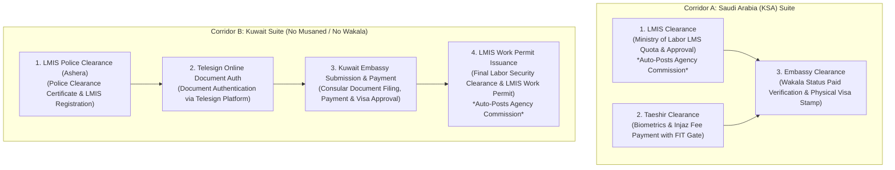

| Operational Dimension | Corridor A: Saudi Arabia (`Saudi Arabia`) | Corridor B: Kuwait (`Kuwait`) |
| :--- | :--- | :--- |
| **Foreign System Ecosystem** | Musaned, Enjaz / Injaz, Taeshir / Tasheer, MOFA KSA | LMIS, Telesign Document Authentication, Kuwait Embassy |
| **Contract Upload** | Musaned contract PDF uploaded & parsed | Kuwait Agency contract PDF uploaded & parsed |
| **Clearance 1** | **LMS Clearance:** MoL LMS approval & quota reservation (**Triggers Agency Commission Auto-Posting**) | **LMIS Police Clearance (Ashera):** Police clearance certificate submission & registration on LMIS |
| **Clearance 2** | **Taeshir Clearance:** Biometrics & Injaz visa fee payment (Blocked if medical != FIT) | **Telesign Clearance:** Online document authentication and verification on Telesign |
| **Clearance 3** | **Embassy Clearance:** Musaned Wakala payment verification & visa stamping (WhatsApp & Push Cron Reminders + On-Demand Trigger) | **Kuwait Embassy Clearance:** Physical/online submission to Kuwait Embassy, consular fee payment, and visa approval |
| **Clearance 4** | Visa endorsement finalized via Injaz | **LMIS Work Permit Issuance:** Final labor security clearance & work permit issued on LMIS (**Triggers Agency Commission Auto-Posting**) |
| **Pre-Departure Guardrail** | Blocked unless LMS + Taeshir (Injaz) + Embassy (Wakala Paid) are complete (*Manager Override Available*) | Blocked unless LMIS Police + Telesign Auth + Kuwait Embassy (Approved & Paid) + LMIS Permit are complete (*Manager Override Available*) |

---

# 4. Multi-Country Architecture, Foreign Agency Portal & Concurrency Control

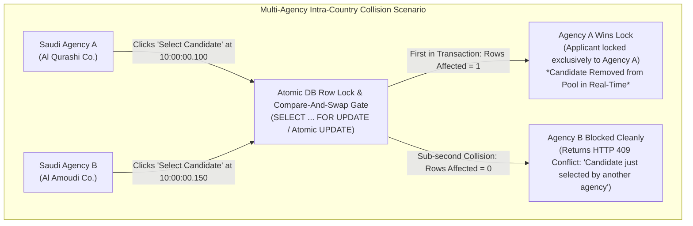

---

# 5. Stakeholders, Role-Based Access Control (RBAC) & Manager Overrides

```mermaid
graph TD
    Admin["System Manager / Agency Owner<br/>*(Holds Manager Override Authority)*"] --> Recruiter["Recruitment & Intake Officer"]
    Admin --> Marketer["Contractor CRM & WhatsApp Dispatcher (Optional)"]
    Admin --> DossierOfficer["Dossier & Contract Specialist (Uploads & Parses Contract)"]
    Admin --> LMIS_Officer["LMIS Clearance Officer (Manages MoL LMS, Missing Data Requests & Medicals)"]
    Admin --> TaeshirOfficer["Taeshir Officer (Injaz Payment & Biometrics Appointment)"]
    Admin --> TelesignOfficer["Telesign Officer (Kuwait Online Document Authentication)"]
    Admin --> EmbassyOfficer["Embassy Officer (Wakala Verification / Kuwait Consular Payment & Stamping)"]
    Admin --> Operations["Pre-Departure / Ticketing Officer (Flight Booking, Rescheduling & Cancelling)"]
    Admin --> Welfare["Welfare & Dispute Officer (Aging Complaint Resolution Desk)"]
    Admin --> Finance["Finance Officer (Commission Ledger Engine & Rate Adjustments)"]
    Admin --> ForeignAgency["Foreign Partner Agencies (Logs Complaints & Selects Candidates via Portal)"]
```

---

# 6. Detailed Functional Specifications

---

## 6.1 Module 1: Applicant Intake & Pluggable Passport Parsing Engine

### Functional Requirements:
1. **Pluggable Architecture (Engine Decoupled):**
   - The system interfaces with a modular **Passport & MRZ Extraction Provider** via a standardized backend adapter interface.
   - The provider can be configured or swapped without changing the UI buttons or applicant schema.
2. **Standard Output Contract:**
   - The extraction adapter populates standardized fields: `passport_number`, `first_name`, `last_name`, `date_of_birth`, `date_of_expiry`, `gender`, `nationality`, `place_of_issue`.
3. **UI Integration:**
   - Dedicated buttons on the New Applicant form: **"Upload & Scan Passport"** and **"Paste MRZ Text"** triggers the active parsing provider, pre-filling all mandatory draft fields before the first save.

---

## 6.2 Module 2: Bilateral CV Generation & Multi-Format Template Engine

### Functional Requirements:
1. **2-Page Layout System:**
   - **Page 1:** Candidate Portrait Photo (2x2), Full Body Standing Photo, Personal Information (Religion, Civil Status, Children, DOB, Age, Education, Languages), Skill Matrix (Cleaning, Washing, Ironing, Baby Sitting, Children Care, Cooking, Arabic Cooking, Sewing, Elderly Care), Monthly Salary & Currency, Previous Overseas Work Experience.
   - **Page 2:** High-resolution embedded Passport Scan, Contact Information, National ID (FIN Number), Labourer ID, Applicant Residential Address, Emergency Contact Person, Next of Kin (Name, Contact, Address), Medical Issue & Expiry Dates, Office Code/Remarks.
2. **Image Encoding & Embedding:**
   - Images automatically converted to Base64 Data URIs to eliminate local path loading failures in PDF rendering engines.
3. **Template Engine:**
   - HTML/CSS template rendered into A4 PDF format ($0\text{mm}$ margins, crisp typography).
4. **Immutable Snapshot Archiving:**
   - Generating a CV archives an immutable `CV Record` document with the exact candidate snapshot data, generated timestamp, operator user, and attached PDF file URL.

---

## 6.3 Module 3: Foreign Agency Portal & Direct Selection

### Functional Requirements:
1. **Foreign Agency Portal API:**
   - `GET /api/method/applicant_processing.applicant_processing.api.get_portal_available_candidates`:
     - Returns available candidates filtered strictly by the logged-in agency's configured country and unreserved status (`locked_contractor IS NULL`).
2. **Direct Atomic Portal Selection RPC:**
   - `POST /api/method/applicant_processing.applicant_processing.api.portal_select_candidate`:
     - Parameters: `applicant_id`.
     - Executes atomic conditional lock (`SELECT FOR UPDATE`). Locks candidate exclusively to the selecting agency for contracting. Returns HTTP 200 on success or HTTP 409 Conflict if selected by a competing agency in the same country.

---

## 6.4 Module 4: Pluggable Contract Structurizer & Muayena Dossier Creation

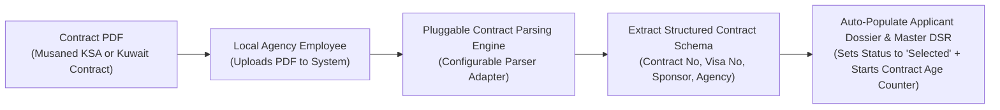

### Functional Requirements:
1. **Pluggable Contract Extractor Architecture:**
   - The contract parsing layer is abstracted into a pluggable parser service, handling both Musaned (Saudi) contracts and Kuwait agency employment contracts.
2. **Extracted Schema Contract:**
   - **Contract & Visa Header:** `Contract Number`, `Visa Number`, `Contract Date`, `Contract Duration`, `Monthly Salary / Amount`, `Profession / Job Applied`.
   - **Under Employer (First Party):** `Employer / Sponsor Name`, `National ID Number / Civil ID`, `Street`, `City`, `Mobile`, `Telephone`.
   - **Under Recruiting Agency (Foreign Office):** `Agency Name`, `License Number`, `Telephone`, `Street`, `City`, `Email`.
   - **Under Her Country Recruitment Agency (Origin Agency):** `Agency Name` (*ANWAR SULTAN FOREIGN EMPLOYMENT AGENT*), `License Number` (*3226*), `Street`, `City` (*Addis Ababa*), `Contact Number`, `Email`.
3. **Contract Processing Age Counter (No Reminder):**
   - Automatically tracks and displays `contract_elapsed_days` starting from the date the contract was parsed for an applicant. Used for operational monitoring; no automated arrival reminder is dispatched.
4. **Support for Muayena Direct Dossier Creation:**
   - When `applicant_type == "Muayena"`, clicking **"Proceed as Muayena"** automatically creates the `Applicant Dossier` in `Selected` state and opens the form directly.
   - Local employee uploads the contract PDF $\rightarrow$ parsing adapter auto-fills fields and initializes master `DSR`.

---

## 6.5 Module 5: Dynamic Multi-Corridor Clearance Engine & Human Flexibility

### 6.5.1 Saudi Arabia Clearance Suite (KSA)
1. **LMS Clearance:** Tracks Labor Ministry System quota filing, contract registration, and labor approval (`Pending`, `Issued`, `Rejected`).
   - **Automatic Commission Trigger:** Upon status transitioning to `Issued`, the system automatically logs the agency-configured commission into the financial ledger.
2. **Taeshir Clearance (Injaz Gate):** 
   - Tracks biometrics appointment and Injaz visa fee payment.
   - **Strict Medical Gate:** If `medical_status != "FIT"`, Injaz payment is strictly blocked (*Manager Override available for special re-test permissions*).
3. **Embassy Clearance (Dual-Trigger Wakala Reminders):**
   - Tracks Musaned Wakala payment status (`Unpaid`, `Paid`).
   - **Automated Monday & Thursday Cron:** If Wakala status is `Unpaid`, dispatches Push API alerts on the Foreign Agency Portal dashboard and automated WhatsApp reminder text messages to the partner agency's registered phone number.
   - **On-Demand Manual Nudge:** Local officer can click **"Send WhatsApp Reminder Now"** or **"Send Portal Push Alert Now"** at any time directly from the candidate dossier to trigger an instant message.
   - Local employee verifies payment, sets status to `Paid`, and proceeds to physical visa stamping.

### 6.5.2 Kuwait Clearance Suite (Kuwait)
1. **LMIS Police Clearance (Ashera):**
   - Tracks candidate Police Clearance Certificate (Ashera) submission, background verification, and initial registration on Kuwait LMIS (`Pending`, `In Progress`, `Completed`, `Rejected`).
2. **Telesign Online Document Authentication (`Telesign Clearance`):**
   - Tracks online document authentication and digital verification via the Telesign system (`Pending`, `In Progress`, `Authenticated`, `Rejected`), capturing Telesign reference numbers and completion dates.
3. **Kuwait Embassy Submission & Payment (`Embassy Clearance`):**
   - Tracks document submission to the Kuwait Embassy (`Pending`, `Submitted`, `Approved`, `Rejected`), consular fee payment tracking (`Unpaid`, `Paid`), embassy receipt number, and consular endorsement date.
4. **LMIS Work Permit Issuance:**
   - Tracks final work permit issuance and labor security clearance on LMIS prior to flight ticketing.
   - **Automatic Commission Trigger:** Upon status transitioning to `Issued`, the system automatically logs the agency-configured commission into the financial ledger.

### 6.5.3 Manager Exception Override Valve
- Authorized System Managers can click **"Grant Clearance Override"** on the DSR to bypass specific non-critical blockers (e.g. special Ministry clearance waiver or exceptional embassy procedure).
- **Mandatory Requirements for Override:** System requires a mandatory text remark (*"Reason for Exception Override"*) and logs an immutable audit entry with timestamp and Manager ID.

---

## 6.6 Module 6: Flight Ticketing, Date Rescheduling, Batch Actions & State Rollbacks

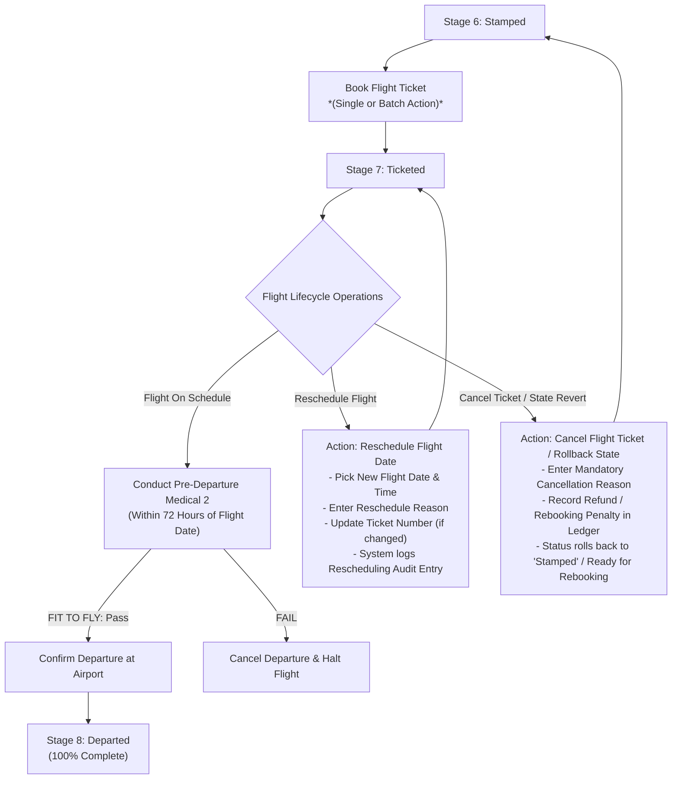

### 1. Batch Operational Workbench (Multi-Candidate Actions):
- Staff can select multiple candidate rows from the List View to execute bulk actions in a single click:
  - **Batch Flight Reschedule:** Set new departure date and airline route for an entire group.
  - **Batch Medical Update:** Bulk record GAMCA Medical Exam results and issue/expiry dates.
  - **Batch LMIS Status Update:** Bulk mark LMS clearances as submitted or issued.

### 2. Forgiving UI & Instant State Rollback ("Undo"):
- If an operator misclicks (*e.g. accidentally clicking "Cancel Applicant" or moving to an incorrect stage*), authorized staff can click **"Revert State"** or **"Un-cancel Applicant"**.
- Prompts for a short reason and restores the candidate record to the previous active state with full audit logging.

---

## 6.7 Module 7: Compliance Timers, Watchdogs & Dual Communication Engine

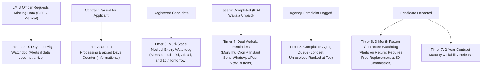

### Specifications for Timers & Notifications:
1. **LMIS Missing Data Request Watchdog (COC & Medical):**
   - The LMIS Officer can trigger a **"Request Data"** action for missing or expired documents (e.g. COC Certificate or GAMCA Medical).
   - If the requested data is not entered within **7 to 10 days**, the system generates an urgent alert badge and task reminder for the assigned officer.
2. **Multi-Tier Medical Validity Expiry Schedule:**
   - Dispatches high-priority notifications according to the exact schedule:
     - **T - 14 Days** (2 weeks remaining)
     - **T - 10 Days** (10 days remaining)
     - **T - 7 Days** (1 week remaining)
     - **T - 3 Days** (3 days remaining)
     - **T - 1 Day** (Tomorrow / 24 hours remaining)
3. **Dual-Trigger Wakala Reminders (Scheduled Cron + Instant Nudge):**
   - **Automated:** Runs every Monday and Thursday morning.
   - **Manual:** Dedicated **"Send WhatsApp Reminder"** and **"Send Push Notification"** buttons on the Applicant Dossier & DSR allow staff to send an immediate alert while on the phone with the agency.
4. **3-Month Free Replacement Guarantee Tracker:**
   - Tracks the 90-day post-departure return guarantee window.
   - If a deployed worker returns to Ethiopia within 3 months, the system alerts the team that the local agency is obligated to provide a **replacement applicant at $0 commission/fees** (since commission was already collected for the original candidate).

---

## 6.8 Module 8: Universal Financial Ledger & Commission Engine

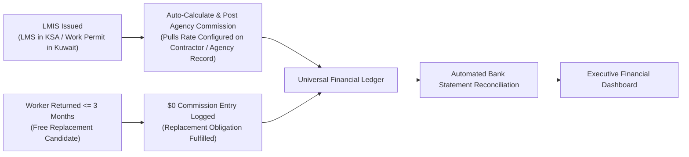

### Financial & Commission Specifications:
1. **LMIS Issuance Automatic Commission Trigger:**
   - When **LMIS is Issued** (MoL LMS in Saudi Arabia or LMIS Work Permit in Kuwait), the system automatically posts the recruitment commission into the candidate's financial ledger.
2. **Agency-Configurable Commission Rates:**
   - Commission amounts are configured per Foreign Partner Agency on the `Contractor` record (`default_commission_amount`, `currency`).
   - The system dynamically looks up the selecting contractor's rate when posting the commission.
3. **Free Replacement Handling ($0 Commission):**
   - For replacement candidates fulfilling a 3-month return guarantee, the commission amount is locked to **0.00**, recording that commission was previously collected.

---

## 6.9 Module 9: Foreign Agency Complaint Management & High-Priority Resolution Portal

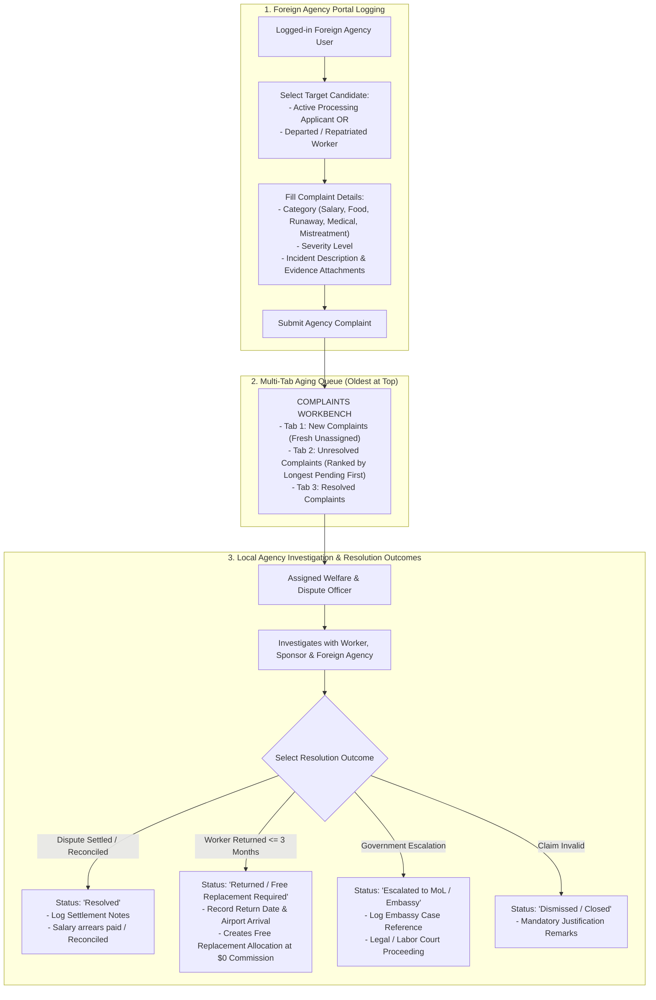

### Functional Requirements:
1. **Multi-Tab Complaints Desk:**
   - **Tab 1 — New Complaints:** Displays freshly logged complaints awaiting review.
   - **Tab 2 — Unresolved Complaints:** Displays open/active disputes **ranked strictly by longest unresolved first** (oldest complaint at the top with age indicators).
   - **Tab 3 — Resolved / Closed:** Archived history with settlement logs.
2. **Standardized Resolution Outcomes:**
   - **`Resolved`**: Dispute settled with worker and sponsor.
   - **`Returned / Free Replacement Required`**: Worker returned within 3 months; flags agency to send a replacement candidate with $0 commission.
   - **`Escalated to MoL / Embassy`**: Referred to labor courts or diplomatic mission.
   - **`Dismissed / Closed`**: Unsubstantiated complaint with recorded justification.

---

## 6.10 Module 10: Executive Daily Work Output & Employee Performance Analytics

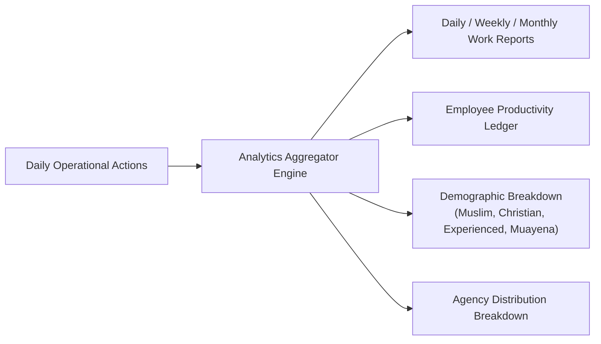

### Reporting Dimensions & KPIs:

1. **Daily Operational Output Summary (Custom Date Range Filter):**
   - **CVs Uploaded / Registered:** Total intake volume (Standard vs Muayena, Muslim vs Christian, Experienced vs Fresh).
   - **Medicals Processed:** GAMCA medicals, FIT, UNFIT, multi-tier expiry alerts (14d, 10d, 7d, 3d, 1d), medical renewals requested.
   - **Contracts Uploaded & Parsed:** Total Musaned & Kuwait contracts parsed, average contract elapsed days.
   - **Taeshir & Injaz Processed:** Injaz payments executed, Taeshir biometrics completed.
   - **Embassy Visas Stamped & Wakala Reminders:** Total embassy visa stamps completed, Wakalas verified, Monday/Thursday Push & WhatsApp reminders dispatched.
   - **Tickets Booked, Rescheduled & Flights Departed:** Total flights booked, rescheduled flights, cancelled tickets, confirmed departures.
   - **Complaints Workbench:** New complaints count, longest pending open complaints count, resolved count, and 3-month replacement allocations.

2. **Employee Performance Ledger:**
   - Metrics per staff member:
     - *How many CVs registered by Employee X in period Y?*
     - *How many contracts uploaded & verified by Specialist X?*
     - *How many LMIS clearances & data renewal requests completed by Officer X?*
     - *How many Taeshir biometrics & Injaz payments handled by Officer X?*
     - *How many Embassy visa stamps secured by Officer X?*
     - *How many tickets booked & rescheduled by Dispatcher X?*
     - *How many agency complaints investigated & resolved by Welfare Officer X?*

---

# 7. Data Dictionary & Entity Relationship (ER) Schema

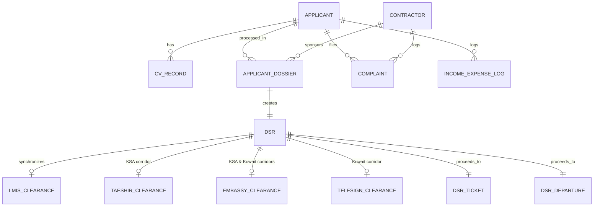

---

# 8. Non-Functional Requirements

1. **Concurrency & Race Condition Handling:**
   - Sub-second selection collisions across multiple agencies handled via atomic database transactions (`affected_rows == 1`). Loser agency receives structured `HTTP 409 Conflict` response with real-time UI notification.
2. **Performance:**
   - Portal candidate catalog queries $\le 200\text{ms}$ with indexed SQL filters.
   - Pluggable OCR/MRZ execution $\le 2.0\text{ seconds}$ per document.
   - Pluggable Contract parsing execution $\le 1.0\text{ second}$ per document.
   - 2-Page CV PDF generation $\le 1.5\text{ seconds}$.
   - Accounting summary rollup across 10,000+ transactions $\le 500\text{ms}$.
3. **Security & Data Isolation:**
   - Foreign agency accounts strictly restricted by country tenant filter; no cross-country candidate leakage.
   - Passport scans, biometric photos, and medical reports stored in access-controlled private storage (`/private/files/`).
   - Token-based API authorization (`Authorization: token <key>:<secret>`) with SSL/TLS encryption.
4. **Auditability:**
   - Every candidate selection, state transition, cancellation, flight rescheduling, manager override, or restore operation logs the performing user ID, timestamp, and mandatory remarks.
