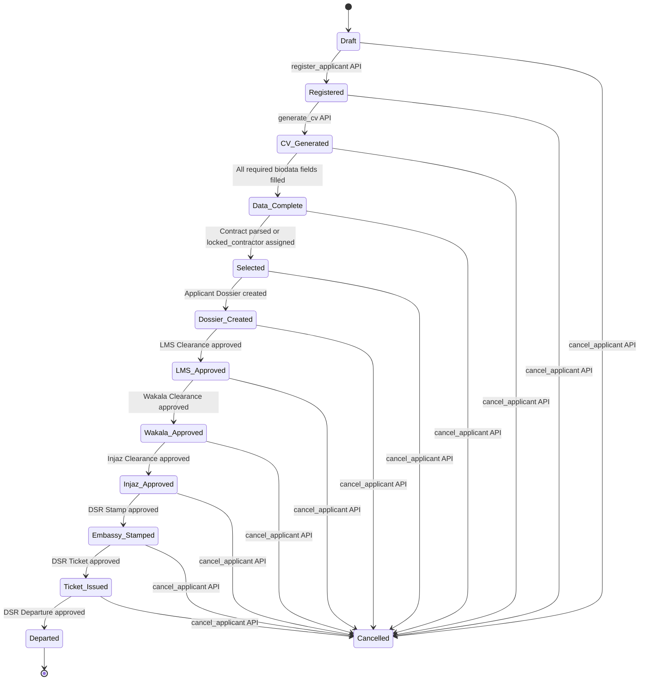

# Authoritative Lifecycle & State Machine Specification

## 1. Lifecycle Overview (12 Canonical States)

The `Applicant.applicant_state` field represents the single source of truth for an applicant's progression through the recruitment pipeline.

---

## 2. State Transition Matrix & Validation Rules

| Step | State Name | State Step | Progress | Trigger / API Method | Validation & Blocking Conditions |
| :---: | :--- | :---: | :---: | :--- | :--- |
| **1** | `Draft` | 1 | 8% | Direct Insert via REST / Form | Initial creation. No blocking validations. |
| **2** | `Registered` | 2 | 16% | `POST /api/method/applicant_processing.applicant_processing.doctype.applicant.applicant.register_applicant` | • `first_name`, `last_name`, `date_of_birth` required. • `medical_status != 'UNFIT'`. |
| **3** | `CV Generated` | 3 | 25% | `POST /api/method/applicant_processing.applicant_processing.doctype.applicant.applicant.generate_cv` | • Applicant must be at least `Registered`. • `medical_status != 'UNFIT'`. • Generates 2-page PDF, embeds photos, uploads to R2. |
| **4** | `Data Complete` | 4 | 33% | Auto-calculated on Applicant Save | Triggered when passport details, skills, and emergency contact details are all populated. |
| **5** | `Selected` | 5 | 41% | Contract parsed via PyMuPDF or Contractor locked | Triggered when `locked_contractor` is populated or `parse_contract_document` matches a sponsor/agency. |
| **6** | `Dossier Created` | 6 | 50% | `Applicant Dossier` Insert | Creating an `Applicant Dossier` linked to the applicant. |
| **7** | `LMS Approved` | 7 | 58% | `LMS Clearance` &rarr; `status = 'Approved'` | Labor Market approval recorded on related DSR. |
| **8** | `Wakala Approved` | 8 | 66% | `Wakala Clearance` &rarr; `status = 'Approved'` | Power of Attorney clearance recorded on related DSR. |
| **9** | `Injaz Approved` | 9 | 75% | `Injaz Clearance` &rarr; `status = 'Approved'` | Electronic visa clearance recorded on related DSR. |
| **10** | `Embassy Stamped`| 10 | 83% | `DSR Stamp` &rarr; `status = 'Approved'` | Visa stamping completed by Embassy. |
| **11** | `Ticket Issued` | 11 | 91% | `DSR Ticket` &rarr; `status = 'Approved'` | Flight booking confirmed and ticket attached. |
| **12** | `Departed` | 12 | 100% | `DSR Departure` &rarr; `status = 'Approved'` | Flight departed and traveler confirmed in destination. |
| **--** | `Cancelled` | -- | 0% | `POST /api/method/applicant_processing.applicant_processing.doctype.applicant.applicant.cancel_applicant` | • Cannot cancel if applicant is already `Departed`. • Records `cancelled_at`, `cancelled_by`, `cancel_remarks`. |

---

## 3. Strict Rules for Frontend Clients

1. **NEVER manually write arbitrary strings to `applicant.applicant_state`**:
   - The backend recalculates `applicant_state`, `state_step`, and `state_progress` automatically using `recalculate_applicant_state(applicant_name)` on every document event and clearance status change.
2. **Medical UNFIT Hard-Block**:
   - If `medical_status == 'UNFIT'`, all registration, CV generation, and dossier processing actions will throw a 417 validation exception.
3. **Cancellation Immutability**:
   - Once an applicant is marked `Departed`, they cannot be cancelled or reverted.
